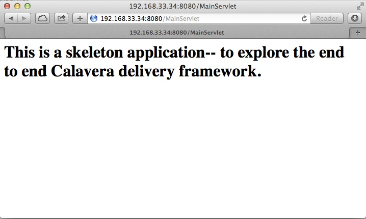

# IT Infrastructure Lab 4 Instructions #
**Overview** 

Lab objectives: 

In this lab, you will initialize a Vagrant machine that has been preconfigured as a simple developer workstation with:

* Java
* JUnit
* Ant
* Tomcat
* git

**Prerequisites**

You must have completed lab 3 and issued pull requests for me.

**Clone the Calavera project**

Log into the main server via ssh in the usual way. 

Make sure you are in your home directory.

    cd ~

Clone the Calavera project (SEIS660 spring 2015 fork). 

````
teststu1@seis660:~$ git clone https://github.com/StThomas-SEIS660/Calavera.git
Cloning into 'Calavera'...
remote: Counting objects: 841, done.
remote: Compressing objects: 100% (401/401), done.
remote: Total 841 (delta 349), reused 823 (delta 331)
Receiving objects: 100% (841/841), 43.76 MiB | 1.60 MiB/s, done.
Resolving deltas: 100% (349/349), done.
Checking connectivity... done.
````
Change to the Calavera directory:
    
    teststu1@seis660:~$ cd Calavera/

Now, you will see a new Vagrantfile. Have a look at it:

    teststu1@seis660:~/Calavera$ more Vagrantfile
    
(You can hit the space bar to go through it, or q to exit.)

There are a number of machines defined, such as 


````
###############################################################################
###################################    base   #################################
###############################################################################
````

Each section like that defines how Vagrant should bring up a machine and configure it. There are a number of new comamnds we haven't seen before. Let's focus on the following:

````
#manos.vm.provision 	    	:shell, path: "./shell/manos.sh"
manos.vm.provision :chef_zero do |chef|
chef.cookbooks_path = ["./cookbooks/"]
chef.add_recipe "shared::default"
chef.add_recipe "git::default"
chef.add_recipe "localAnt::default"
chef.add_recipe "java7::default"   
chef.add_recipe "tomcat::default"
chef.add_recipe "shared::_junit"
chef.add_recipe "manos::default"
````

You used a shell provisioner in your previous lab to apply your script to your new VM. But what's this? It's commented out here (the # means that Vagrant won't execute that line). 

Instead, we are starting to use Chef. As we discussed in Lecture 03, Chef is a configuration management system. Now, a full treatment of Chef is beyond the scope of this class. However, you should look at a few things. You should still be in your Calavera directory. Run tree:

````
teststu1@seis660:~/Calavera$ tree
.
├── Berksfile
├── cookbooks
│   ├── base
│   │   ├── metadata.rb
│   │   └── recipes
│   │       └── default.rb
│   ├── brazos
│   │   ├── metadata.rb
│   │   └── recipes
│   │       └── default.rb
│   ├── cara
│   │   ├── metadata.rb
│   │   └── recipes
│   │       └── default.rb
│   ├── cerebro
│   │   ├── files
│   │   │   └── post-receive
│   │   ├── metadata.rb
│   │   └── recipes
│   │       └── default.rb
│   ├── espina
│   │   ├── files
│   │   │   └── artifactory-3.5.1.zip
│   │   ├── metadata.rb
│   │   └── recipes
│   │       └── default.rb
│   ├── hombros
│   │   ├── files
│   │   │   ├── hijoInit.xml
│   │   │   └── jenkins-cli.jar
│   │   ├── metadata.rb
│   │   └── recipes
│   │       └── default.rb
│   ├── java7
│   │   ├── attributes
│   │   │   └── default.rb
│   │   ├── metadata.rb
│   │   └── recipes
│   │       └── default.rb
│   ├── localAnt
│   │   ├── attributes
│   │   │   └── default.rb
│   │   ├── files
│   │   │   └── ant.sh
│   │   ├── metadata.rb
│   │   └── recipes
│   │       └── default.rb
│   ├── manos
│   │   ├── files
│   │   │   ├── build.xml
│   │   │   ├── Class1.java
│   │   │   ├── INTERNAL_gitignore
│   │   │   ├── MainServlet.java
│   │   │   ├── TestClass1.java
│   │   │   └── web.xml
│   │   ├── metadata.rb
│   │   └── recipes
│   │       └── default.rb
│   ├── shared
│   │   ├── files
│   │   │   ├── calaverahosts
│   │   │   └── ssh.sh
│   │   ├── metadata.rb
│   │   └── recipes
│   │       ├── default.rb
│   │       └── _junit.rb
│   └── test
│       ├── metadata.rb
│       └── recipes
│           └── default.rb
├── docs
│   └── img
│       ├── CalaveraArchitecture.jpg
│       ├── Jenkins integrated.jpg
│       ├── Jenkins master-slave.jpg
│       ├── Simplified.jpg
│       └── skull.jpg
├── Gemfile
├── LICENSE
├── metadata.rb
├── README.md
├── shared
│   ├── ant.sh
│   └── README.txt
├── startup.bat
├── startup.sh
└── Vagrantfile

34 directories, 53 files
````

Hint: if you are using Putty or some other terminal emulator and getting garbage characters like âââ in your tree, see this:

http://unix.stackexchange.com/questions/61293/how-can-i-change-locale-encoding-to-avoid-getting-weird-characters-in-terminal

This directory structure is the entire Calavera project, which is a simple DevOps simulation that all runs through Vagrant. 

Again, notice in the Vagrantfile the directives:

    manos.vm.provision :chef_zero do |chef|
    
The above tells Vagrant to use Chef to set up the virtual machine.

    chef.cookbooks_path = ["./cookbooks/"]
    
The above tells Chef where the cookbooks are.

````
chef.add_recipe "shared::default"
chef.add_recipe "git::default"
chef.add_recipe "localAnt::default"
chef.add_recipe "java7::default"   
chef.add_recipe "tomcat::default"
chef.add_recipe "shared::_junit"
chef.add_recipe "manos::default"
````

Finally, the above tells Chef to apply a series of recipes from various parts of the tree. These recipes install software and configure the system in various ways. 

*Have a look at some of them.*  Use "cat."

The combination of these recipes precisely describes what the virtual machine will look like. If you delete a VM and bring it back up, it should look exactly the same every time. 

Now, the current Vagrantfile is a little dangerous, because if you type "vagrant up" it will try to bring up ALL of the machines. So, I have created a branch in git with a Vagrantfile for just the manos machine. Let's switch to that. 

Return to the Calavera base directory and issue the following:

````
teststu1@seis660:~/Calavera$ cd ~/Calavera/
teststu1@seis660:~/Calavera$ git checkout Cala-04
Branch Cala-04 set up to track remote branch Cala-04 from origin.
Switched to a new branch 'Cala-04'
teststu1@seis660:~/Calavera$ 
````
Now, do "cat Vagrantfile". You should see that Manos is the only machine left. Vagrant up manos:

    teststu1@seis660:~/Calavera$ vagrant up manos
    
**Important**
If you get
````
An error occurred while downloading the remote file. The error
message, if any, is reproduced below. Please fix this error and try again.

Couldn't open file /home/student/beno6137/Calavera/opscode-ubuntu-14.04a
````
you need to export an environment variable. Type

    export VAGRANT_HOME=/var/vagrant/.vagrant.d
    
and it now should work. 

Manos comes preconfigured with a running Tomcat instance and a simple test-harness based Java application. You can see it running when you ssh in:

````
teststu1@seis660:~/Calavera$ vagrant ssh
Welcome to Ubuntu 14.04.2 LTS (GNU/Linux 3.13.0-24-generic x86_64)

 * Documentation:  https://help.ubuntu.com/
Last login: Sat Feb 21 22:03:53 2015 from 10.0.2.2
vagrant@manos:~$ curl localhost:8080/MainServlet
<h1>This is a skeleton application-- to explore the end to end Calavera delivery framework.</h1>
````
What is "curl"? curl is like a browser for the command line. Because we are not bridging VMs to the external world, and we haven't yet set up XWindows (and I am not sure we will get to that this semester given the overhead) we can't run Chrome, IE or Firefox to see the application. But, if you had a browser able to connect to the virtual machine, it would show:




Let's look at what goes into making this little app work. First, how did it get there? Exit from your ssh into the VM, if you are still in there. 

You can see the resources used by the application if you go:

````
teststu1@seis660:~/Calavera$ tree cookbooks/manos/
cookbooks/manos/
├── files
│   ├── build.xml
│   ├── Class1.java
│   ├── INTERNAL_gitignore
│   ├── MainServlet.java
│   ├── TestClass1.java
│   └── web.xml
├── metadata.rb
└── recipes
    └── default.rb
````
    
Now, the cookbook here essentially includes the raw ingredients (the contents of the cookbooks/manos/files directory) as well as the recipes of how to set them up on the VM. Especially, have a look at cookbooks/manos/recipes/default.rb:

````
teststu1@seis660:~/Calavera$ cat cookbooks/manos/recipes/default.rb
# manos-default

# set up developer workstation

# assuming Chef has set up Java, Tomcat, ant and junit
# need to establish directory structure
# move source code over

package "tree"

group 'git'

user 'vagrant' do
  group 'git'
end

["/home/hijo/src/main/config",
 "/home/hijo/src/main/java/biz/calavera", 
 "/home/hijo/src/test/java/biz/calavera",
 "/home/hijo/target/biz/calavera"].each do | name |

  directory name  do
    mode 00775
    action :create
    user "vagrant"
    group "git"
    recursive true
  end
end

file_map = {
  "INTERNAL_gitignore" => "/home/hijo/.gitignore",
 "build.xml" => "/home/hijo/build.xml",
 "web.xml" => "/home/hijo/src/main/config/web.xml", 
 "Class1.java" => "/home/hijo/src/main/java/biz/calavera/Class1.java",
 "MainServlet.java" =>  "/home/hijo/src/main/java/biz/calavera/MainServlet.java",
 "TestClass1.java" => "/home/hijo/src/test/java/biz/calavera/TestClass1.java"
}

# download each file and place it in right directory
file_map.each do | fileName, pathName |
  cookbook_file fileName do
    path pathName
    user "vagrant"
    group "git"
    action :create
  end
end

...
````

There is more, but you get the idea. Without going into the Ruby code this is written in (which would be too much detail for this class), this script  is creating a set of directory structures on the new manos VM and populating them with the basic Java and Ant files needed. For example, this command: 

    "build.xml" => "/home/hijo/build.xml"
    
essentially says, take the file called "build.xml" from the files directory on the host, and copy it into /home/hijo/build.xml on the guest. 

Go back into your manos VM and have a look at the home/hijo directory:

````
teststu1@seis660:~/Calavera$ vagrant ssh
Welcome to Ubuntu 14.04.2 LTS (GNU/Linux 3.13.0-24-generic x86_64)

 * Documentation:  https://help.ubuntu.com/
Last login: Sun Feb 22 18:29:29 2015 from 10.0.2.2
vagrant@manos:~$ tree /home/hijo
/home/hijo
├── build.xml
├── src
│   ├── main
│   │   ├── config
│   │   │   └── web.xml
│   │   └── java
│   │       └── biz
│   │           └── calavera
│   │               ├── Class1.java
│   │               └── MainServlet.java
│   └── test
│       └── java
│           └── biz
│               └── calavera
│                   └── TestClass1.java
└── target
    ├── biz
    │   └── calavera
    │       ├── Class1.class
    │       ├── MainServlet.class
    │       └── TestClass1.class
    ├── CalaveraMain.jar
    ├── result.txt
    ├── result.xml
    └── web.xml

````

That configured directory tree is the outcome of the Chef scripts that were applied when the first Vagrant up was done. But wait, there is more. How is Tomcat actually serving up the servlet? 

Go: 

````
vagrant@manos:/home/hijo$ tree /var/lib/tomcat6/webapps/ROOT/WEB-INF/
/var/lib/tomcat6/webapps/ROOT/WEB-INF/
├── lib
│   └── CalaveraMain.jar
└── web.xml

1 directory, 2 files
````

In order for the CalaveraMain.jar file to be served up, it needs to be put in the WEB-INF/lib directory that Tomcat knows about, and the web.xml file needs to be updated as well. How did this happen?

And as a matter of fact, where did that CalaveraMain.jar file come from, anyways? It wasn't part of the files stored in the cookbook...!? Go back and look. 

This is where the magic of Ant comes in. CalaveraMain.jar is a **compiled and packaged** version of the java classes you see in the java/biz/calavera directory. 

Back when Java first came out, the developer would have to painstaking compile and package the software by hand, move it manually to the Tomcat directory, and restart Tomcat. But with Ant (and similar tools like Maven), we can do this all automatically. Go:

````
vagrant@manos:/home/hijo$ sudo ant
Buildfile: /home/hijo/build.xml

init:
     [echo] 
     [echo] 			Computer name is ${my_env.COMPUTERNAME}
     [echo]                         User name is root
     [echo] 			Building from /home/hijo/build.xml
     [echo] 			Java is version 1.7
     [echo] 			Project is ${ant.project.name}
     [echo] 			Ant is Apache Ant(TM) version 1.9.4 compiled on April 29 2014
     [echo] 			Basedir is /home/hijo
     [echo] 			Source is ./src/main/java/biz/calavera
     [echo] 			Build target is ./target
     [echo] 			Deployment target is /var/lib/tomcat6/webapps/ROOT/WEB-INF/lib
     [echo] 		

compile:
    [javac] Compiling 2 source files to /home/hijo/target
    [javac] Compiling 1 source file to /home/hijo/target

test:
     [echo] 
     [echo] 			entering test
     [echo] 		
    [junit] Running biz.calavera.TestClass1
    [junit] Tests run: 1, Failures: 0, Errors: 0, Skipped: 0, Time elapsed: 0.074 sec

compress:
      [jar] Building jar: /home/hijo/target/CalaveraMain.jar

deploy:
   [delete] Deleting directory /var/lib/tomcat6/webapps/ROOT/WEB-INF/lib
    [mkdir] Created dir: /var/lib/tomcat6/webapps/ROOT/WEB-INF/lib
     [copy] Copying 1 file to /var/lib/tomcat6/webapps/ROOT/WEB-INF/lib
     [echo] 
     [echo] 			Attempting Tomcat restart. 
     [echo] 		
     [exec] The command attribute is deprecated.
     [exec] Please use the executable attribute and nested arg elements.
     [exec]  * Stopping Tomcat servlet engine tomcat6
     [exec]    ...done.
     [exec] The command attribute is deprecated.
     [exec] Please use the executable attribute and nested arg elements.
     [exec]  * Starting Tomcat servlet engine tomcat6
     [exec]    ...done.

main:
     [echo]  
     [echo] 			built and deployed to Tomcat.
     [echo] 		

BUILD SUCCESSFUL
Total time: 8 seconds
````

(Points to anyone who can rewrite the Ant script so that it's not using the deprecated Ant command attribute generating the warnings at the bottom.)

You can see the Ant script at build.xml. Compare that script to the output. It is:

- Running the junit tests (more on that later)
- Compiling the java *.java files into *.class files
- Packaging the *.java files into a *.jar file
- Moving the jar file to the appropriate Tomcat directory, along with the web.xml configuration file
- Restarting Tomcat

If you are interested in Ant further, you can see more about it at http://ant.apache.org/. 

Let's play with the Java a little bit. Go:

````
vagrant@manos:/home/hijo$ nano src/main/java/biz/calavera/MainServlet.java 

  GNU nano 2.2.6                      File: src/main/java/biz/calavera/MainServlet.java                                                            Modified  

package biz.calavera;

//package test;

import java.io.*;
import javax.servlet.*;
import javax.servlet.http.*;

public class MainServlet extends HttpServlet {
        // Import required java libraries
         
          private String message;

          public void init() throws ServletException
          {
              // Edit this message, save the file, and rebuild with Ant
              // to see it reflected on the Web page at http://localhost:8081/MainServlet
              message = "This is a skeleton application-- to explore the end to end Calavera delivery framework.";
          }

          public void doGet(HttpServletRequest request,
                            HttpServletResponse response)
                    throws ServletException, IOException
          {
              // Set response content type
              response.setContentType("text/html");

              // Actual logic goes here.
              PrintWriter out = response.getWriter();
              Class1 oResp = new Class1(message);
              
              out.println(oResp.webMessage());
          }
          
          public void destroy()
          {
              // do nothing.
          }
        }
````
Find the line that says: 

    message = "This is a skeleton application-- to explore the end to end Calavera delivery framework."

and change it to 

    message = "YourStudentID This is a skeleton application-- to explore the end to end Calavera delivery framework."

Exit nano and run Ant again:

    vagrant@manos:/home/hijo$ sudo ant
    [ same output as before ] 

Now try:

    vagrant@manos:/home/hijo$ curl localhost:8080/MainServlet
    <h1>YourStudentID This is a skeleton application-- to explore the end to end Calavera delivery framework.</h1>

If you did it correctly, you should see that Tomcat (via curl) is now serving up the change you made. Many automated steps were executed between you making that change and it appearing in curl!

Let's add it to git:
````
vagrant@manos:/home/hijo$ git add src/main/java/biz/calavera/MainServlet.java
vagrant@manos:/home/hijo$ git commit -m "my local java"
[master 04ff3cb] my local java
 1 file changed, 1 insertion(+), 1 deletion(-)
```` 
Review your change:


````
vagrant@manos:/home/hijo$ git log -p -1
commit 04ff3cb11264ed3429889512451722c3069b3264
Author: Charles Betz <char@calavera.biz>
Date:   Sun Feb 22 19:44:19 2015 +0000

    my local java

diff --git a/src/main/java/biz/calavera/MainServlet.java b/src/main/java/biz/calavera/MainServlet.java
index 35cdac4..54f2be4 100644
--- a/src/main/java/biz/calavera/MainServlet.java
+++ b/src/main/java/biz/calavera/MainServlet.java
@@ -15,7 +15,7 @@ public class MainServlet extends HttpServlet {
          {
              // Edit this message, save the file, and rebuild with Ant
               // to see it reflected on the Web page at http://localhost:8081/MainServlet
-             message = "This is a skeleton application-- to explore the end to end Calavera delivery framework.";
+             message = "YourStudentID This is a skeleton application-- to explore the end to end Calavera delivery framework.";
          }
 
          public void doGet(HttpServletRequest request,
````

Now, let's break something. 

Go: 

````
vagrant@manos:/home/hijo$ nano src/main/java/biz/calavera/Class1.java 

  GNU nano 2.2.6                                 File: src/main/java/biz/calavera/Class1.java                                                                          

package biz.calavera;


public class Class1 {
          String strMsg;
          
          public Class1 (String inString)
          {
                    strMsg = inString;
          }
        public String five()
        { 
                return "five";
        }

          public String webMessage()
          {
              return "<h1>" + strMsg + "</h1>";
          }


        }
````

Replace 

    return "five";

with 

    return "four";
    


Rebuild with ant:

````
vagrant@manos:/home/hijo$ sudo ant
Buildfile: /home/hijo/build.xml

init:
     [echo] 
     [echo] 			Computer name is ${my_env.COMPUTERNAME}
     [echo]                         User name is root
     [echo] 			Building from /home/hijo/build.xml
     [echo] 			Java is version 1.7
     [echo] 			Project is ${ant.project.name}
     [echo] 			Ant is Apache Ant(TM) version 1.9.4 compiled on April 29 2014
     [echo] 			Basedir is /home/hijo
     [echo] 			Source is ./src/main/java/biz/calavera
     [echo] 			Build target is ./target
     [echo] 			Deployment target is /var/lib/tomcat6/webapps/ROOT/WEB-INF/lib
     [echo] 		

compile:
    [javac] Compiling 2 source files to /home/hijo/target
    [javac] Compiling 1 source file to /home/hijo/target

test:
     [echo] 
     [echo] 			entering test
     [echo] 		
    [junit] Running biz.calavera.TestClass1
    [junit] Tests run: 1, Failures: 1, Errors: 0, Skipped: 0, Time elapsed: 0.074 sec

BUILD FAILED
/home/hijo/build.xml:69: Test biz.calavera.TestClass1 failed

Total time: 1 second
````

We got something quite different - a failed build. We can see the results this way:

````
vagrant@manos:/home/hijo$ cat target/result.txt
Testsuite: biz.calavera.TestClass1
Tests run: 1, Failures: 1, Errors: 0, Skipped: 0, Time elapsed: 0.074 sec

Testcase: testTrue took 0.012 sec
	FAILED
five is 5 expected:<f[ive]> but was:<f[our]>
junit.framework.AssertionFailedError: five is 5 expected:<f[ive]> but was:<f[our]>
	at biz.calavera.TestClass1.testTrue(Unknown Source)
````

Notice we can still curl. The broken build was not deployed to the local Tomcat. 

````
vagrant@manos:/home/hijo$ curl localhost:8080/MainServlet
<h1>YourStudentID This is a skeleton application-- to explore the end to end Calavera delivery framework.</h1>
````

Let's abandon the changes that broke the build:

    vagrant@manos:/home/hijo$ git reset --hard
    
This command discards all changes you have not committed. 
    
Do 

    cat rc/main/java/biz/calavera/Class1.java 
    
and you will see "four" reverted to "five." 

Finally, let's go back to the original version without YourStudentID in the message:

````
vagrant@manos:/home/hijo$ git log --pretty=short --abbrev-commit
commit 3b810e4
Author: Charles Betz <char@calavera.biz>

    my local java

commit b45dc90
Author: Charles Betz <char@calavera.biz>

    initial commit

vagrant@manos:/home/hijo$ git revert 3b810e4
````
You will need to edit the revert message in nano. 

````
[master b66c1c9] Revert "my local java"
 1 file changed, 1 insertion(+), 1 deletion(-)
```

See that "YourStudentID" is now removed, as we have reverted to the original version of the code. 

```` 
vagrant@manos:/home/hijo$ cat src/main/java/biz/calavera/MainServlet.java 
````


