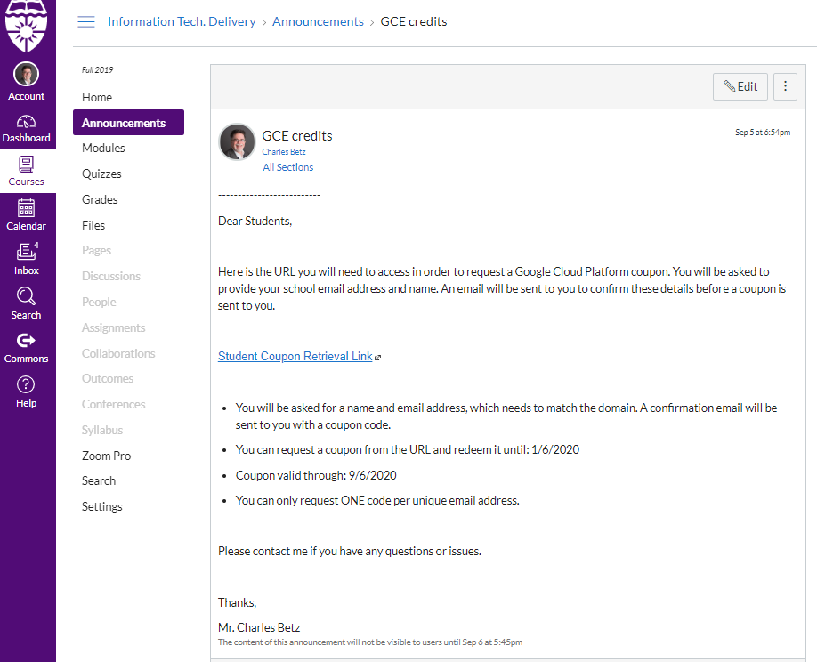
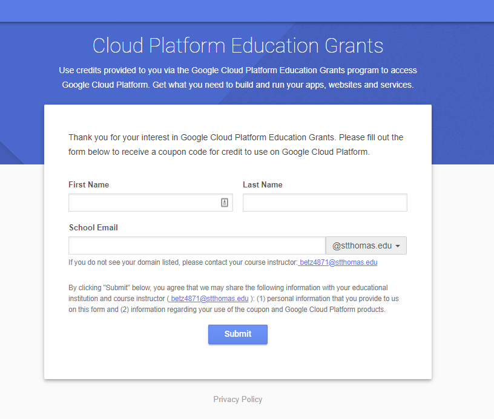
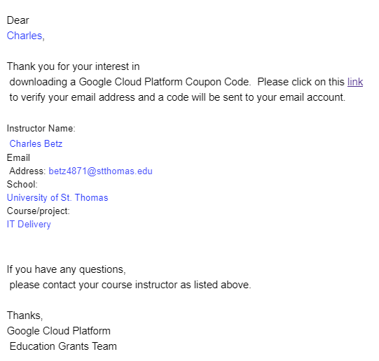
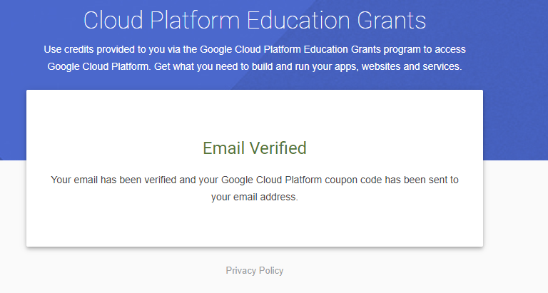
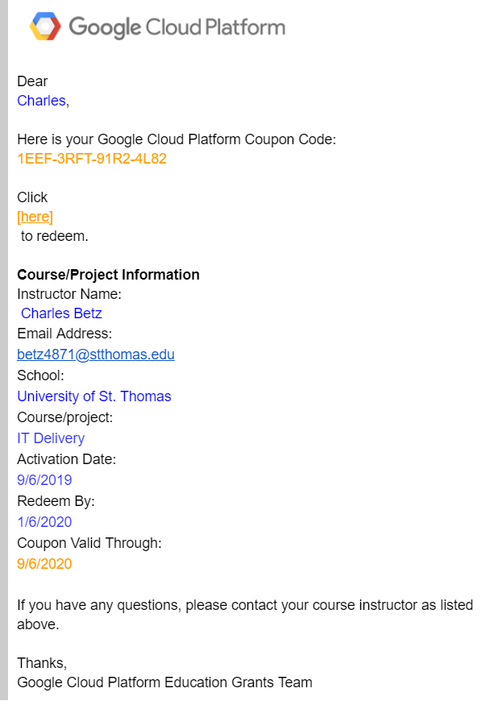
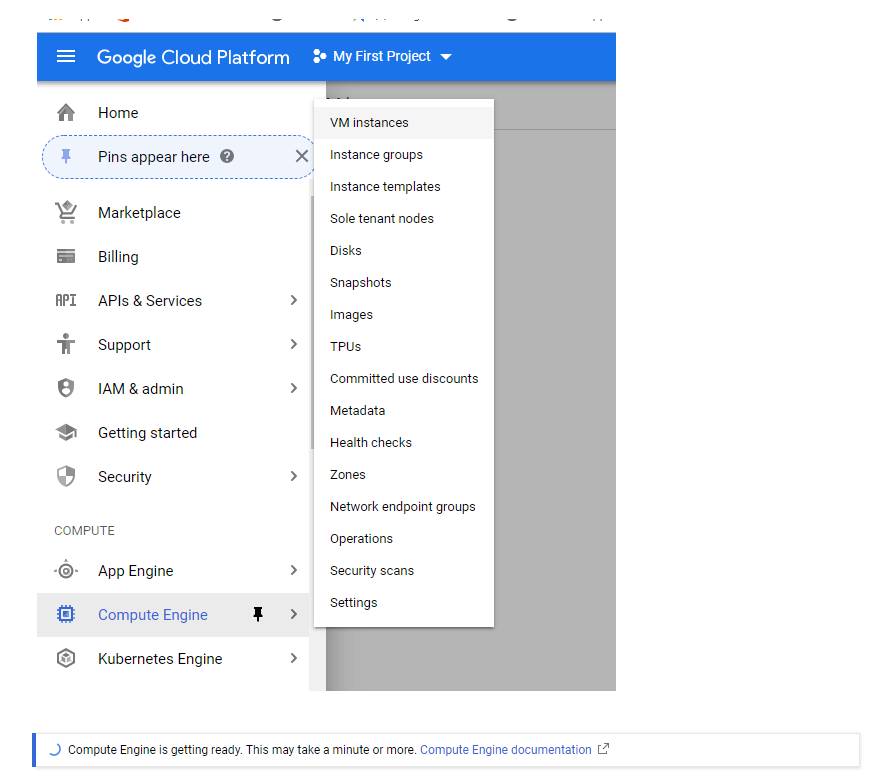
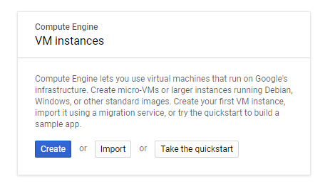
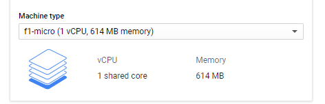
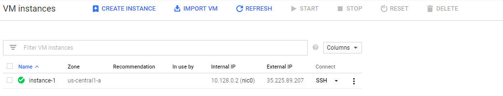
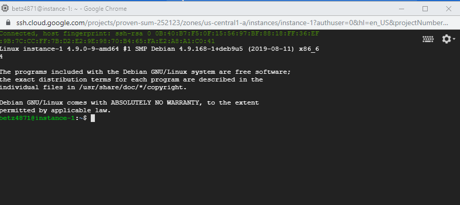

= SEIS664 Lab 00

NOTE: We are in a bootstrapping phase. We need to get you set up on Github and Google Cloud so that you can learn Linux. But that means you need to execute some Linux without knowing much about it. Do your best to follow the instructions. 

Objectives of this lab: 

- Set up Slack
- Set up Github
- Set up Google Compute Engine
- Create a VM
- Start the Linux tutorial (you may finish it in the week to come)

== A note on accounts
By the time you are done with this lab, you will have: 

* A St. Thomas email account (actually, you came in with this)
* A Slack account, that should have the same name as your St. Thomas email but will have a different password
* A Github account, that should *not* have the same name as your St. Thomas email
* A Google account, for running Google Compute Engine

This is FOUR different passwords, as well as a public/private key pair, with a passphrase, for Github. It's your responsibility to keep these accounts straight and NOT get confused which has what password. I recommend the use of a password keeper such as 1Pasword or LastPass. 

== Setting up Slack

* Slack will be the main communication channel.
* I strongly prefer questions be posted in Slack rather than via calling me over. Leverage your classmates for support. 
* Navigate to https://seis664.slack.com/[https://seis664.slack.com/].
** Click "create an account" and remember your password. You should use your St. Thomas email. Whether you use it or another email, you will need a SEPARATE and DISTINCT password from any other Slack accounts you have. This is just how Slack works; you have to maintain multiple accounts.
** Confirm you can read messages. Try posting to the https://seis664.slack.com/messages/general/[#general] thread.
** The channels are not cleared from the previous semester. Have a look, you'll get a feel for the class. 
** To find a channel, click on Channels and it will say "Browse All Channels"

== Setting up Github account
=== Getting started

Go to http://github.com and set up a user account (one per individual, even if you are in teams). You do NOT want to use your school email account name for this, as your Github account may be an asset throughout your career. *Choose a suitably professional user name that you can use for the rest of your professional career.* 

Set up a private/public key pair for your Github credentials. Start by going to Git Bash under your Windows menu. 

Next, review these instructions: 

https://help.github.com/en/articles/generating-a-new-ssh-key-and-adding-it-to-the-ssh-agent

https://help.github.com/en/articles/adding-a-new-ssh-key-to-your-github-account

https://help.github.com/en/articles/testing-your-ssh-connection

and follow them. 

Autoconfigure your Git Bash to launch the ssh-agent every time: 

https://help.github.com/en/articles/working-with-ssh-key-passphrases

You can create a .profile file using Visual Studio Code (VSCode). 

Close and re-open Git Bash. 

Now, run this tutorial: 

https://product.hubspot.com/blog/git-and-github-tutorial-for-beginners

=== Clone this repository

A key strategy of this course is that the students contribute to the learning materials ongoing. Therefore, these instructions you are reading right now are something that we all collaborate on. You need to know how to change the instructions to help correct errors or add insights you may have developed as you work through them. 

When you have finished the tutorial, download this repo to your computer. Open Git Bash and type: 

`cd`

`mkdir repos`

`cd repos`

`git clone git@github.com:dm-academy/aitm-labs.git`

Now, you should have all the lab files locally on your machine. You can open them in VSCode or other text editor. In this way you can change them and submit changes back to the central repo as pull requests. Try submitting a minor change to this file via the techniques presented in the tutorial. Note that you will not be able to accept the change, as I am the maintainer of this file. I would have to approve. 

IMPORTANT: From this point forward, you are STRONGLY ENCOURAGED to submit issues and enhancements to the course documentation. Extra credit points are readily available for contributing to the class in this manner. Don't allow yourself to "get stuck." Communicate with your classmates in Slack and if you are still stuck then raise a Github issue. If you are stuck, the problem is in the instructions, and we need to fix it. 

== Accessing Google Compute Engine

For this lab we are going to work with Google Cloud to setup a micro-instance of a virtual machine.

As this is your first lab, please read this manual carefully and follow along. It may be difficult or nearly impossible to start over if you make certain key mistakes. 

=== Account Setup

First, YOU MUST HAVE A PERSONAL GMAIL ACCOUNT. I recommend using Chrome and signing into GMail with it. IF YOU USE YOUR SCHOOL EMAIL THIS WILL NOT ONLY NOT WORK, BUT YOU WILL NOT BE ABLE TO FINISH THE LAB. Go to https://mail.google.com if you don't have a personal GMail account yet. 

In the Canvas announcements there is a copy of an email from Google. Click the "Student Coupon Retrieval Link" to redeem and then read the following very carefully.

You will get the following:

Your *St. Thomas email* (NOT your Gmail account) is required for the first form, this is where you will get the coupon (Google requires a valid student account with a university or college). 

Fill in your name and email. You'll get an email like this: 

Click on the link in the email and you should see this:

Finally you will get this email with your code:

(Do NOT use the code in the image above. Use the code you got in your email.)

Go to http://cloud.google.com now and enter your code:

image::gcp-accept.png[]

You should be dumped to a screen that looks like this:

image::billing-acct.png[]

This is the Billing page. It tells you how much money you have in your account. All of your Projects will be linked to this billing account. This is how cloud computing works.

=== Creating a virtual machine (VM)

Now, you will create your VM.

You can create as many VMs as you want, but keep in mind that your account will be charged for each moment a VM is online. Note that you should never put your personal credit card information into Google Compute Engine. This is 100% free for you.

The reason we’re using a micro-instance is that it is free to your account, as long as you don’t send/receive too much data. More info here on that: http://cloud.google.com/free. We won’t be needing any amount of power behind the scenes, unless if you need it for your term project.

First, click the options menu (3 horizontal lines) on the top left and then click Compute Engine. This will take a while. 

When the "Create" button is enabled, click it:

Leave the defaults, except select the f1-micro type: 

Click Create (scroll down). VM instance creation will take a few minutes.

So now that's the instance is running (green check), open the instance by clicking its name and looking at the details and monitoring tabs.

=== Remote Access
It is now time to SSH into your server. Google Cloud makes this ridiculously easy to do in the browser. Go back to the VM instances page and click the SSH button. 

This will pop open an SSH window, similar to this:

Yay! You are now in your Linux virtual machine.

== Linux tutorial

Now that you have a functioning Linux instance, run this Linux tutorial. 

https://ryanstutorials.net/linuxtutorial/

It's fine if you work on this during the week, but *you need to have it completed by next week.* The quiz will cover it, so do not take the quiz until you are done with the tutorial. 