= Lab 00  Course setup


In this lab, you will set up the tools and access you need for the rest of the semester.

== Objectives for this lab
* Locate and use the Canvas and Slack collaboration tools
* Configure your terminal emulator
* Securely connect to course server via ssh and (possibly) x-windows
* Collaborate and support each other.

This lab suffers from what is called a https://en.wikipedia.org/wiki/Catch-22_(logic)[Catch-22], a "no win" situation. You can't learn Linux without connecting to the server, and you can't connect to the server without learning a little Linux.

Because of this, you will go through a set of instructions that may not make much sense. You will have plenty of support from your instructor and hopefully your classmates. Do NOT get discouraged. The first thing you will do next week is run a Linux tutorial. We've had good experiences in this class getting everyone up to speed on these basics.

== Prerequisites
You need access to a Windows (7 or greater), Mac OS X (10.9.5 or greater) or Ubuntu Linux machine on the St. Thomas network. It can be your machine or one of the machines in the classroom.

If you have your own machine, you should be comfortable downloading and installing software on it.

If you want to use a tablet (iPad or Android), you are ON YOUR OWN. (It probably could be done - SSH & X clients exist - but we don't have the bandwidth to support it.)

Same for any other platform.

== Tasks

=== Using Canvas
Canvas is relatively new. If you have issues, inform the instructor. Go to Canvas and find this lab. (instructor displays this on screen.)

=== Collaborating on Slack

* Slack will be the main communication channel.
* Navigate to https://seis664.slack.com/[https://seis664.slack.com/].
** Click "create an account" and remember your password. You should use your St. Thomas email. Whether you use it or another email, you will need a SEPARATE and DISTINCT password from any other Slack accounts you have. This is just how Slack works; you have to maintain multiple accounts.
** Confirm you can read messages. Try posting to the https://seis664.slack.com/messages/general/[#general] thread.
** The channels are not cleared from the previous semester. Have a look, you'll get a feel for the class. SEIS660 & SEIS664 alumni may lurk and assist if they feel like it, as long as they are constructive.
** To find a channel, click on Channels and it will say "Browse All Channels"

=== Setting up your terminal emulator on Windows

* Classroom machine: PuTTY and PuTTYGen should be installed
* Windows on your laptop: Go to http://www.chiark.greenend.org.uk/~sgtatham/putty/download.html[the Putty website]
** Download the latest installer (*putty-0.66-installer.exe* as of Feb 2016, at the  bottom of the screenshot) and run it.

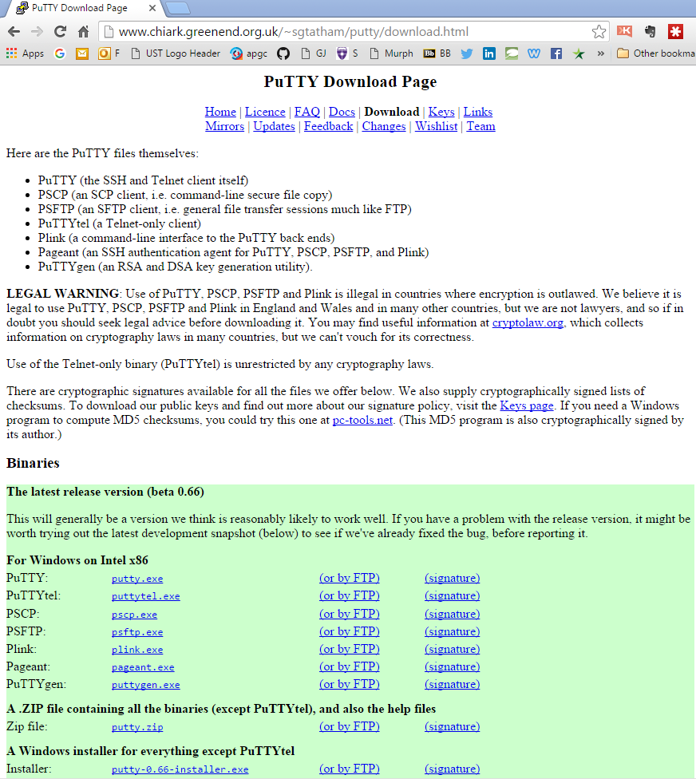

It will ask you to save or run.

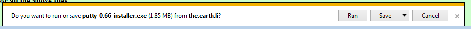

Click Save, then Run.

image::dlComplete.PNG[]

You'll get a security warning. Click Yes.

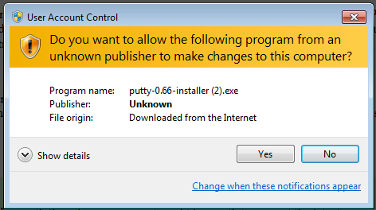

The Putty setup will start. Click Yes.

image::puttySetup1.png[]

The default location is fine:

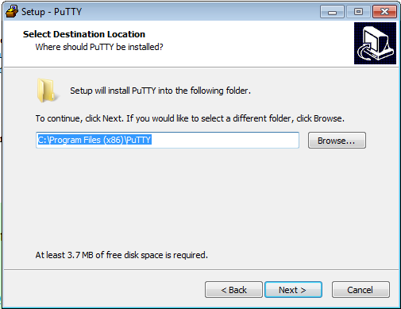

Start menu shortcut is fine:

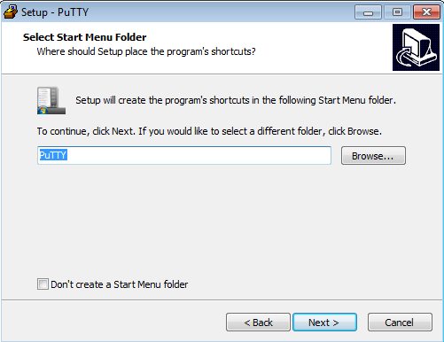

Go ahead and select desktop and quicklaunch (not a big deal if you miss this, easily done later):

image::puttySetup4.png[]

Finally, click Install.

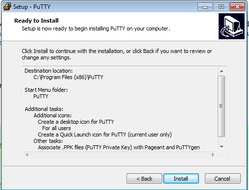

Check the README - always a good idea, although nothing to worry about this time around.

NOTE: It is worth learning how to set up Putty profiles so you can quickly log in with your preferred configuration. Consult the instructions and experiment. 

image::puttySetup6.png[]

You may also use Cygwin, TeraTerm, Bitvise, or any other SSH client of your choice. You’re on your own for this.


=== Setting up your terminal emulator on Mac

 On your MacOS laptop, go to Applications|Utilities|Terminal and drag it to your Dock.

=== Logging in
You will be provided usernames, temporary passwords, and the server name in class. In the next section you will use your terminal emulator to log into the server, by entering the server address, your name, and password as appropriate.

NOTE: Logging in with a password will be only possible for the duration of the lab. The "cleartext login" functionality will be https://help.ubuntu.com/community/SSH/OpenSSH/Configuring[disabled].

NOTE: When you type a password into Linux, the cursor does not move.

==== Logging in (Windows)

Launch Putty from your Start menu.

Enter your username and server as indicated (given in class) and click Open:

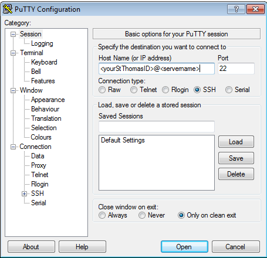

You will get the following:

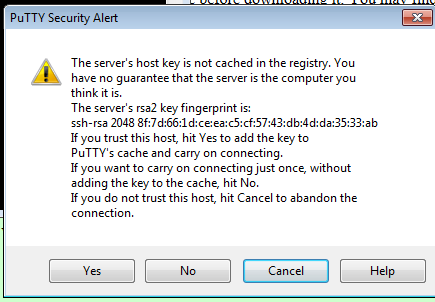

If you get this:

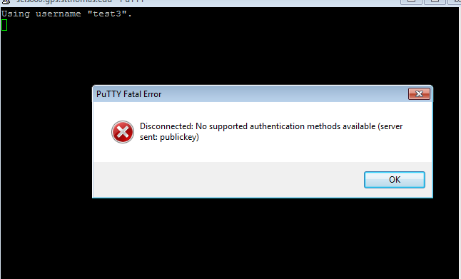

it means that you are trying to log in without using public key at some other time than the scheduled Lab 00. Review these instructions again.

You should get this:

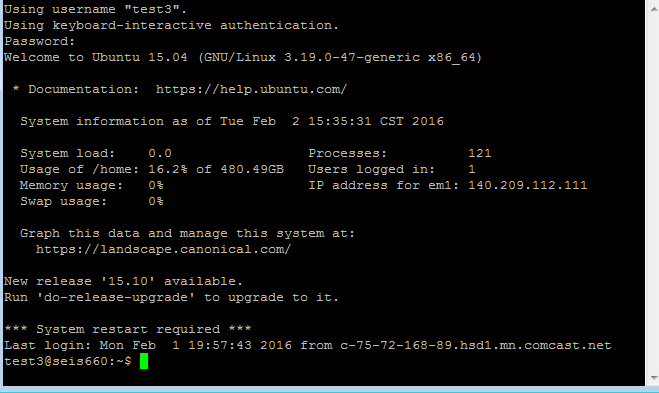


==== Logging in (Mac/Linux)

On the Mac, launch your Terminal and type:

> ssh <yourStThomasID>@<servername>

on the Mac OS. The servername is provided in class.

Your St. Thomas ID here means the first portion of your email address, not your student number.

You should see a result similar to the screen above, with slightly different Mac graphics.

=== Changing your password
Once you have logged in, do not type anything or "move around" in the directory structure. You should be in your home directory in a "clean," newly initialized account.

IMPORTANT: In the exercises below, do not type the "#" or anything after it. The "$" and ">" above represent the prompt the operating system displays for you. It may have your name or other stuff before it. In rare cases, it might be a different character like ">" or "&". In any case, you don't type the prompt character.

Also, where you see text surrounded by angle brackets <>, substitute the indicated value. Do not type the angle brackets.

The first order of business is to change your password. Type:

```
$ passwd     #password change command
Changing password for test3.
(current) UNIX password: <enter the password given in class>
Enter new UNIX password: <enter a new password of your choice>
Retype new UNIX password: <enter your new password again>
passwd: password updated successfully
```


=== Setting up ssh for your account on the server (all platforms)
While logged into the server, go::

```
$ cd ~      # makes sure you are in home directory
$ mkdir .ssh   # creates a directory for your ssh key
$ cd .ssh      # moves you inside it
$ touch authorized_keys   #creates an empty file for your keys
```
and then, only for Mac users:

 $ exit

(Windows users will need to stay logged in for the next part.)

If there are any errors post them to the discussion room for assistance.

=== Configuring SSH - Windows

*Windows machines (both classroom machines and your laptop):*

Leaving your terminal session running, go to your Windows start menu and open PuTTYGen (it will be in the PuTTY program group folder):

image::puttyGen1.png[]

You will get the following screen. Leave the defaults and click Generate:

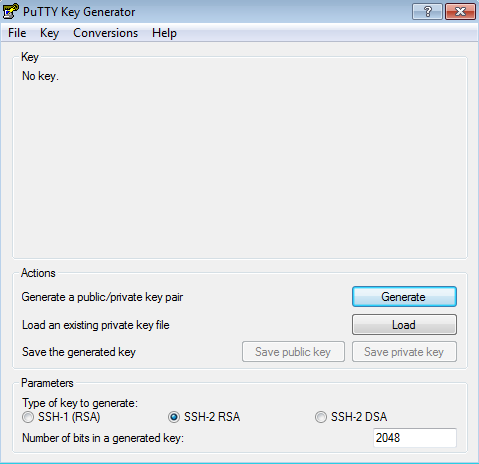

Move the mouse until the key is generated:

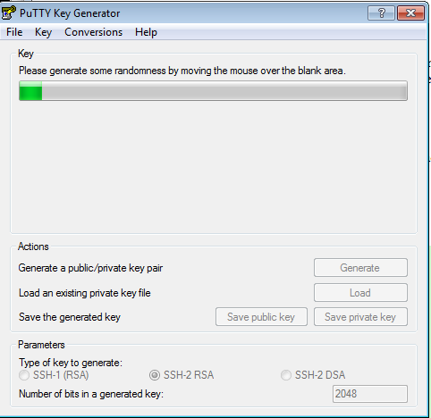

You may choose a passphrase (like a password, but often people choose a simple sentence with spaces in it). If you choose a passphrase, it will always be required when you log in. However, it operates differently than a password (it is integrated with your private key) and should not be confused for a password stored on the server.

Save your public key to a folder on your Desktop called Putty as "pubkey".

Save the private key to the same folder as "privKey".

(You can use other names. Just remember which is which and where they are.)

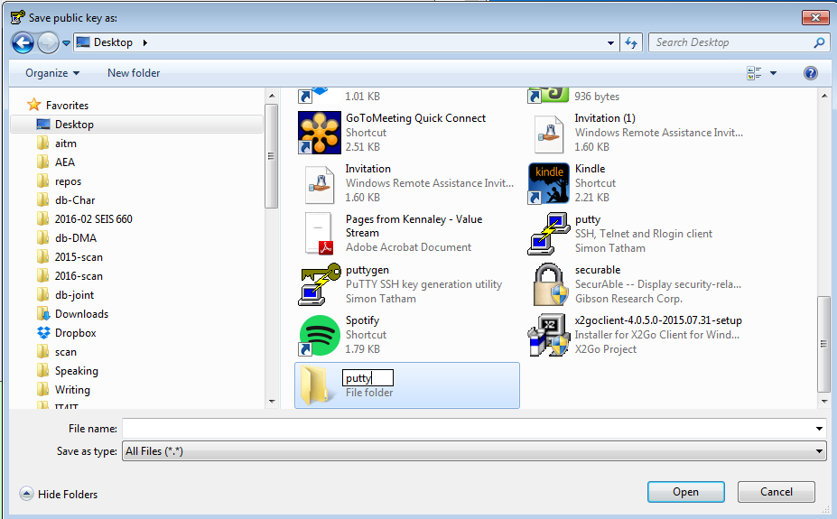

Leave puTTYGen open. Notice the box towards the top, "Public key for pasting..." Select ALL that text and copy it by hitting Control-C. (You MUST scroll down. This is poor usability. Every class, people select only what they can see and it doesn't work. The key should end in "...rsa-key-YYYYMMDD")

image::puttyGen5.png[]
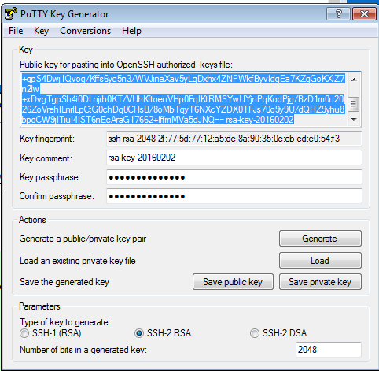

Now return to your terminal session. Go:

$ nano authorized_keys   # edit your public keys

You will see:

image::nano.png[]

Carefully place your cursor on the black terminal screen and right click once. This *should* paste your key into the editor. It should look like this:

image::nano2.png[]

The text you see is just the end of your private key. If you hit return it should show you the beginning:

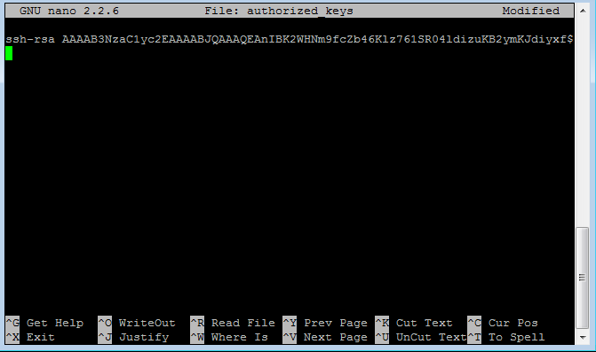

Hit Ctrl-O to save (WriteOut):

image::nano4.png[]

Accept the suggested file name by hitting Enter. Then hit Ctrl-X to exit.

You have now configured the server with your public key. You can log into it without using a password, if you have your private key. Let's try that now.

Type

 $ exit    # abandon terminal session

There are two ways to authenticate with your new key. We recommend Pageant. Go back to your start menu and launch it:

image::puttyGen1.png[]

Now (here's the tricky part): Go to your syspanel:

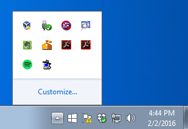

and find this icon:


Right click on it and select "Add Key." Select your private key file. You will need to enter your passphrase:

image::passphrase.png[]

Now, go back to PuTTY and type in the server information and Open:


You should get this, with no password prompt:

image::finalLoginWindows.png[]

You have successfully configured Putty.

You will need to launch Pageant every time you log in and give it your private key and passphrase. I recommend keeping your private key on a USB stick, or other secure location.

If you want to log into the server from home, you must have your private key on your home computer.

You can email your key to yourself if you must. (Not the best security practice.)

Optional:

You can save your login information as a profile in PuTTY, may save you some time.

You can give it your key on a one-time basis under the SSH configuration node.

=== Configuring SSH - Mac OS

IMPORTANT: On the Macintosh, be sure you are logged out of the course server. These next commands need to be performed on your local machine, while connected to the network.

If you're not already in it, bring up your Terminal application (under Applications|Utilities). *At the window for your local computer*  type:

 $ cd ~/.ssh
 $ ssh-keygen

It will suggest a name, id_rsa; that is fine.

You may choose a passphrase - like a password but usually a sentence with spaces. However, it operates differently than a password (it is integrated with your private key) and should not be confused for a password stored on the server. Now:

 $ cat id_rsa.pub

You will get output like:
```
ssh-rsa AAAAB3NzaC1yc2EAAAADAQABAAABAQDRycwk4jklWQyzmXi/QtM6ky+85O3C5291GDCOuvzn3Q4t83Sv2wkN69aLhLk53Lfw5SU1unOWb0Cj2xi+El8D5oR+Yncovz53uqSFmiDuHKNH3bQBUS4v15n6AkJ9nqvJtJZ0iuFD1zSlP3JqeSk5e2NPCmqSbWKEOijOsGWeVHxbs2z8I5PcD2Yrd9nDwhpg84eRUHamgZvvDS83lb5A0cUK5lQXr6zinAhWsELtCZCfSOYf5gaL3ADI53hSHekDMeJvK0r+em0NLb9dwSJnJJYBJ+Eb8xhj+hSrw3pkSHGhsPYDth99vkDnPdSQNrNoVhwmJxa3T4sbLy2O+WWn xxxxxx@xxx..xxx.local
```
Copy the output to your Clipboard (highlight and Command-C).

Now log back into the course server with your name and password.

 $ ssh <yourStThomasID>@<servername>

Go:
```
 student@server:~$ cd .ssh    # go to .ssh directory
 student@server:~/.ssh$ nano authorized_keys   # edit your public keys
```

NOTE: The following screenshots are from the Windows client but the Mac terminal should look substantively the same.

You will see:

image::nano.png[]

Carefully place your cursor on the black terminal screen and right click once. This *should* paste your key into the editor. It should look like this:

image::nano2.png[]

The text you see is just the end of your private key. If you hit return it should show you the beginning:


Hit Ctrl-O to save (WriteOut):

image::nano4.png[]

Accept the suggested file name by hitting Enter. Then hit Ctrl-X to exit.

You have now configured the server with your public key. You can log into it without using a password, if you have your private key. Let's try that now.

Type

 $ exit    # abandon terminal session

You should now be able to log into the server by going

 ssh yourname@servername.domain

and it will NOT require a password, because you are using your key pair to authenticate.

====
*QUESTION:*

Why didn't I automate this? It would have been a simple script to set it all up in advance and provide you all your private keys. Discuss.
====

====
*IMPORTANT:*

Protect your private key, especially if you start to use it in significant ways (e.g. as the basis of your work with Github.) Don't leave it where others can access it.
====

=== Configuring X windows

We will spend some time as a class determining whether and how X-windows is working for you all.

NOTE: As of Fall 2015, there is new X-windows software in the lab. We will all be getting familiar with it.

To use X-windows, log into the course server, enabling X windows for the connection, as described in the following.

*Windows* If you are on a windows machine using Putty you will have a checkbox (that may have defaulted to checked) to enable X. If someone figures out the compression options, please suggest.

Open the X windows client, http://sourceforge.net/projects/xming/[XMing] (install if necessary). (Start Menu|XMing|Xming)

*Mac OS* As of February 2015, Macs no longer are bundled with X. In newer machines, the http://xquartz.macosforge.org/landing/[XQuartz application] X windows client needs to be downloaded and installed on your computer.

NOTE: At this iteration of the lab, we have not had time to detail installation instructions screen by screen.

=== Using X-windows

If you are on Putty, log out and log back in, this time checking the X11 forwarding in SSH:

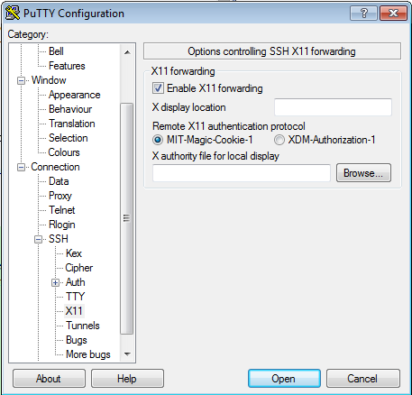


UPDATED IMPORTANT INFO FOR MAC USERS:

There are issues with XQuartz. The standard Mac console app does not seem to work with Quartz in Sierra, you may get display errors.

Launch XQuartz and right-click on its icon in the Dock. Select Applications|Terminal and you will get a slightly different console app, which should work as follows below.

image::XQTerm.png[]

Log out and log back in to the classroom server with the following options if you are on a Mac:

    ssh -YC yourID@server.domain

*All OS* The quickest test for X-windows is to run the command

    xclock

It may take some time, but you should see a clock:

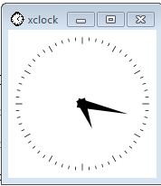

If it does not work, it may be an issue with X-windows on the client.

If you have trouble, do not raise your hand immediately. Instead, first ask the question in the chat room.

WHEN you are done with the lab, log into the chat room and discussion board and assist until all of your classmates are done.

== Discussion
Google "Why is SSH key authentication better than password authentication?" and discuss top 2-3 hits with your partner. Be prepared to discuss if called on.

== Common errors

* Instructor creating .ssh directory or authorized_keys as root, with incorrect permissions - must be owned by user, and private keys must be locked down
* Student copying partial key from PuTTYGen
* Student failing to load private key into PuTTY every time (either manually, via Pageant, or through incorrect use of profiles)
* Failure to actually launch XMing client
* sies664 vs seis664
* typing in unnecessary prompt characters the lab instructions say to omit ($, >, etc)
* Sometimes the system will tolerate mulitiple keys (e.g. from multiple tries) in the .ssh directory. But sometimes it won't. If you are having problems, move all keys but the current one you are trying into a backup directory.

== Notes
todo: illustrate difference between public/private key
