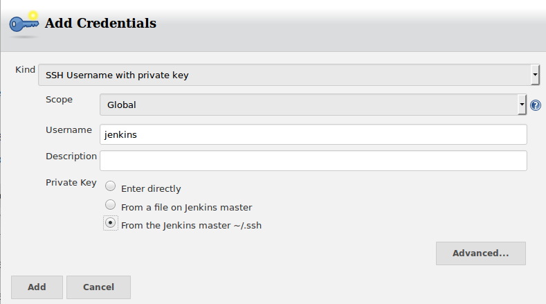

= Tech lab 04 (version 2)

In the previous version of this lab, multiple full pipelines were set up, one per team.

In this version of the lab, each student has their own development and production environments, flowing through a centralized development pipeline. In this way, each student gets a fuller experience.

This lab is a work in progress.

Slack is expected.

== Adapting manosXX to be one of many

You are assigned a number "XX" where XX may be from 03-34.

=== Change the Vagrantfile
These instructions assume comprehensive familiarity with Unix commands and operations. Literal instructions are limited.

`ssh -YC` into the server. (On windows, Putty with X enabled.)

`su public1`; password given in class.

`cd ~/VMs` to the ~/VMs directory

`mkdir XX` where XX is the 2-digit number you have been assigned.

* Copy `~/Calavera/lab-04-Vagrantfile` to the directory you just created, giving it the name `Vagrantfile`.

* `nano` ~/VMs/XX/Vagrantfile and do the following:
** Search replace on the manosXX name where XX is your number (e.g. from manosXX to manos03 or manos16)
** Use the nano search/replace command.

Change the manosXX IP to end in 20 + your #

** Change the ports
*** guest: 22, host: 2120 + your #
*** guest: 80, host: 8120 + your #
*** guest: 8080, host: 9120 + your #

** Search replace on the caraXX name

Change the caraXX IP to end in 50 plus your #

** Change the ports
*** guest: 22, host: 2150 + your #
*** guest: 80, host: 8150 + your #
*** guest: 8080, host: 9150 + your #

=== Connect your server with cerebro1 (git origin)

In this section you will bring up and log into your server, then from there access cerebro1 and configure your origin git repo, then connect your server's remote to that origin.

`vagrant up manosXX` where XX = the number you have been given

IMPORTANT: Synch point. Do not proceed until all students have caught up. Go to Slack and help your classmates.

 vagrant ssh manosXX
 cd /home/hijo
 ssh cerebro1

"yes" to the ECDSA prompt if it appears.

`sudo git init --bare --shared=group /home/hijoXX.git`

WARNING: Be sure to replace "XX" in the above command and those that follow!!!

Why are we using git init --bare? Look it up.

 sudo chown -R git /home/hijoXX.git/
 sudo chgrp -R git /home/hijoXX.git/
 sudo cp /home/cerebro1/cookbooks/cerebro/files/post-receive /home/hijoXX.git/hooks/
 sudo chown git /home/hijoXX.git/hooks/post-receive
 sudo chmod 775 /home/hijoXX.git/hooks/post-receive
 sudo nano /home/hijoXX.git/hooks/post-receive

change XX in the below to your #, or add it if not there

  curl http://hombros1:8080/git/notifyCommit?url=git@cerebro1:/home/hijoXX.git

 exit

IMPORTANT: You should now be back to manosXX

=== Initialize the remote

NOTE: The "hijo" directory on your manosXX virtual machine does NOT have a number.

 cd /home/hijo     # just to be sure
 ssh-keyscan cerebro1 >> ~/.ssh/known_hosts
 git remote add origin ssh://cerebro1/home/hijoXX.git
 exit

You should now be NOT in any VM, but logged in to the main server as "public1"

 exit

You now should be logged in as yourself.

=== Configure Jenkins

If on a class workstation: Putty with X, launch XLaunch and accept all defaults.

 firefox -x -no-remote

go to http://127.0.0.1:9113

IMPORTANT: Synch point. Do not proceed until all students are here. Go to Slack and help.

In Jenkins:

TIP: If confused, look at the Jenkins configurations for hijo02 and hijo03..

Go:

New Item

Freestyle

* Item name hijoXX (OK)
* Restrict where it can be run
* Label Expression brazos1
* Source code management "Git"
* Repository URL `ssh://jenkins@cerebro1/home/hijoXX.git`
* Credentials|add

* Branch Specifier: */master
* Poll SCM
* Generic Artifactory Integration
* Artifactory upload server: `http://espina1:8081/artifactory`
* Download & upload by legacy patterns
* Target repository: ext-release-local (click Refresh Repositories)
* Published Artifacts:

 **/target/*.jar=>hijoXX
 **/target/web.xml=>hijoXX

* Capture and publish build info

* Build:
** Add build step
** Invoke Ant
** Targets: init compile test compress

* Save

* Close Firefox (to save load on server)

IMPORTANT: Synch point. Do not proceed until all students are here. Go to Slack and help.

=== Kick off pipeline

* Back to command line (log into seis664 again if needed)

* su public1

* cd ~/VMs/XX

* vagrant ssh manosXX

From this point, I am not going to give you as many explicit commands.

Navigate to the /home/hijo directory. You can run `sudo ant` to make sure ant and Tomcat are running.

Now, let's push your local repo to cerebro.

 git push origin --mirror

Now, you should open a NEW terminal session, X-windows enabled, and go back into Jenkins. Also You can open a new tab in FireFox and go to http://127.0.0.1:7112/artifactory, login is "admin/password." Go to the Artifacts tab and open ext-release-local. Observe that you do not yet have a directory there.

On your manos instance, from /home/hijo, make a small change to  src/main/java/biz/calavera/MainServlet.java, just the message regarding the "skeleton application." You can change any words/letters within that string.

Then, after you've made the change, go:

 git add . -A
 git commit -m "my first commit"
 git push origin master

If all is well you should see something *like*:

....
[master 5de8bfc] my first commit
 1 file changed, 1 insertion(+), 1 deletion(-)
vagrant@manos03:/home/hijo$ git push origin master
Counting objects: 15, done.
Compressing objects: 100% (6/6), done.
Writing objects: 100% (8/8), 679 bytes | 0 bytes/s, done.
Total 8 (delta 1), reused 0 (delta 0)
remote:   % Total    % Received % Xferd  Average Speed   Time    Time     Time  Current
remote:                                  Dload  Upload   Total   Spent    Left  Speed
remote: 100   101  100   101    0     0   5619      0 --:--:-- --:--:-- --:--:--  5941
remote: Scheduled polling of hijo03
remote: No Git consumers using SCM API plugin for: git@cerebro1:/home/hijo03.git
To ssh://cerebro1/home/hijo03.git
   2c5e543..5de8bfc  master -> master
....

Refresh Artifactory. You should see that you have a directory. This is your production-ready package!

IMPORTANT: Synch point. Do not proceed until all students are here. Go to Slack and help.

=== Initialize CaraXX

This is deliberately challenging. Support each other on Slack.

In short, you need to create your own deployment recipe caraXX based on cara02.rb in /var/SEIS660/public1/Calavera/cookbooks/cara/recipes/. When we are done, that directory will have multiple caraXX.rb files.

* Update your Vagrantfile accordingly.

* vagrant up and test your application

== Use the pipeline

Make a change to your application and push it all the way through the pipeline. Post a screenshot to Slack of either Firefox or a curl invocation.

Break your build.
