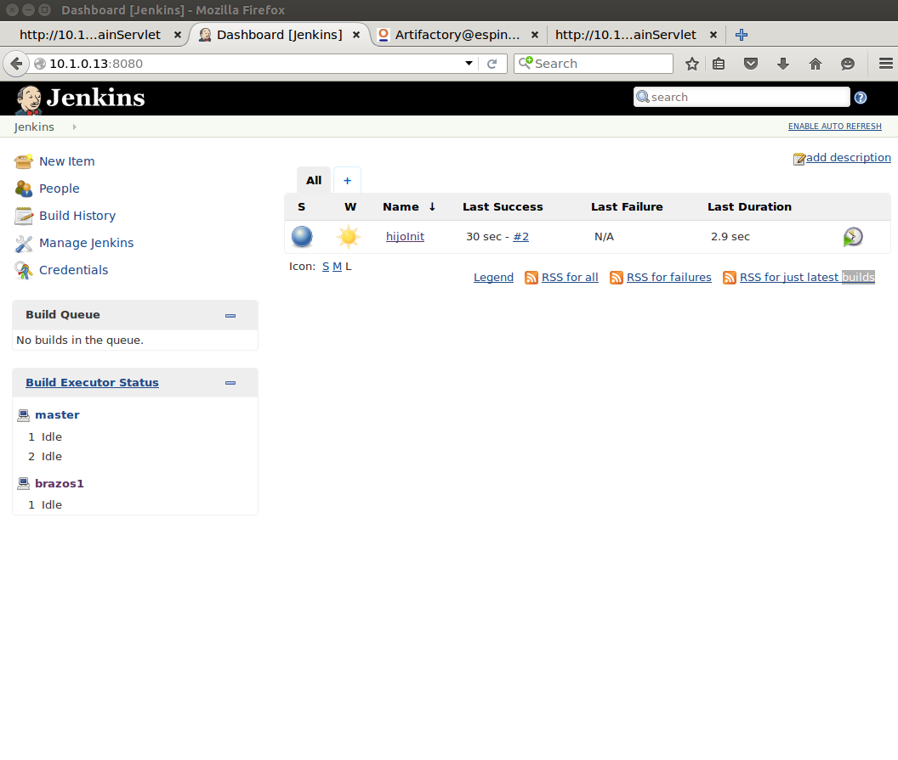

= Lab 04 (Technical) End to end DevOps-based software product management

== Overview

In this lab, you will work as a team with an end to end DevOps pipeline.

*Lab objectives:*

* Examine the details of an end to end DevOps pipeline and participate in it using your development environment.

* Start to build a product pipeline, from ideation through delivery.

Now, before you get hands on, you need to define your team's roles. I suggest, but do not require, the following:

* Product owner (1)
* Business analyst (1-2)
* Developer (2 required)
* QA analyst (1)
* Tools specialist (1)

If you have a different idea, please discuss with me.

Consider taking turns in the roles.

You are now in 4 teams, each building a unique product. Your teams are numbered 1-4.

You will want two X-enabled sessions into the server (technically only one needs to be X enabled, but let's keep it simple).

Four users have been set up:

* public1
* public2
* public3
* public4

The passwords are announced in class. You cannot ssh in as these users. Please do not attempt to configure ssh for them.

Instead, ssh in as yourself with BOTH your sessions.

=== X-windows session

Enable your local X client if needed (e.g. launch XMing). In one session (as yourself) do

 $ firefox -no-remote

Firefox should open in X. Open four tabs, with the following URLS (substitute the xx as appropriate):

* manosxx:8080/MainServlet
* hombroxx:8080
* espinaxx:8081
** log into Artifactory with the combination 'admin/password'
* caraxx:8080/MainServlet

Your tabs should look more or less like these:

image::manos.png[]
image::hombros.png[]
image::espina.png[]
Note that espina has been logged into and the tab switched to Artifacts where you can see the packaged Calavera artifacts.

image::cara.png[]

Compare these to the Calavera architecture:

image::http://dm-academy.github.io/aitm/images/1.03-pipeline.png[]

****
Discuss: Why don't we open URLs to cerebro and brazos? What happens if you try? Why?
****

=== Terminal session

In your other session, do

`$ su publicxx`

where xx = 1 through 4, appropriate to your team.

Then:

....
$ cd ~/Calavera
$ vagrant ssh manosxx
....

where "xx" is your team number.

NOTE: While we use 'xx' to represent your team #, there is no leading zero. So, for example, Team 1 would `vagrant ssh manos1`, *not* `manos01`.

=== Try it out!
You are going to make a change, test it out locally, commit it to git locally, and then push it to the central repository (cerebro). When you do this, it will trigger a remote build and test, and you will see on the Jenkins dashboard whether it succeeded or failed. You will be doing DevOps!

Logged in manosxx as publicxx, refer back to lab 03 and change the MainServlet.java message again.

Rebuild the application (`sudo ant`)

You should be able to refresh your Firefox tab *for manosxx* and see your change.

Commit your change to git locally:

....
vagrant@manos1:/home/hijo$ git add . -A
vagrant@manos1:/home/hijo$ git commit -m "my first change"
[master 7787dd4] my first change
 1 file changed, 1 insertion(+), 1 deletion(-)
vagrant@manos1:/home/hijo$ git push origin master
Counting objects: 15, done.
Compressing objects: 100% (6/6), done.
Writing objects: 100% (8/8), 685 bytes | 0 bytes/s, done.
Total 8 (delta 1), reused 0 (delta 0)
remote:   % Total    % Received % Xferd  Average Speed   Time    Time     Time  Current
remote:                                  Dload  Upload   Total   Spent    Left  Speed
remote: 100    30  100    30    0     0   1676      0 --:--:-- --:--:-- --:--:--  1764
remote: Scheduled polling of hijoInit
To ssh://cerebro1/home/hijo.git
   17751d3..7787dd4  master -> master
vagrant@manos1:/home/hijo$
....

The last command is likely unfamiliar. What is it?

Look again at the Calavera architecture:

image::http://dm-academy.github.io/aitm/images/1.03-pipeline.png[]

See the arrow going from "local git" to "Source repo "Cerebro""? When you push to "origin master" you are taking your local commit and replicating it to the master repository on cerebro, where other developers may pull it down to their workstations.

The first part of the response is just a report on transmitting the data, not very interesting:
....
Counting objects: 15, done.
Compressing objects: 100% (6/6), done.
Writing objects: 100% (8/8), 685 bytes | 0 bytes/s, done.
Total 8 (delta 1), reused 0 (delta 0)
remote:   % Total    % Received % Xferd  Average Speed   Time    Time     Time  Current
remote:                                  Dload  Upload   Total   Spent    Left  Speed
remote: 100    30  100    30    0     0   1676      0 --:--:-- --:--:-- --:--:--  1764
....

But the second part is more interesting:

....
remote: Scheduled polling of hijoInit
To ssh://cerebro1/home/hijo.git
   17751d3..7787dd4  master -> master
vagrant@manos1:/home/hijo$
....

What is this? It is a _githook_.

We can see the githook on cerebroxx, if we were to log in to it (don't bother right now). If we did so, we could see:

 $ cat /home/hijo.git/hooks/post-receive
 (some comments)
 curl http://hombrosxx:8080/git/notifyCommit?url=git@cerebroxx:/home/hijo.git

Have a look at the curl command. What is it doing?

This bit of code tells git (running on cerebro), *when it detects a new commit to the hijo repository,* to reach out over a standard Web connection to the hombros server, and to pass the URL parameter 'git@cerebroxx:/home/hijo.git' to the notifyCommit resource.

Discuss with your team what this does and how it works. In particular, review what the hombrosxx server does.

So, when hombrosxx receives the call from the githook, how does it know what to do? Go to your X-windows Firefox, and open the hombros tab with the Jenkins GUI.

image::hijoInitLink.png[]

Click on the hijoInit link. This represents the build job that is launched via the githook.

Click on the Configure link:

image::hijoCfg2.png[]

There are a lot of settings of the next page. The upper section is basic info for the project:

image::basicInfo.png[]

Further down, we see:

image::gitRepo.png[]

See the "Repository URL" section. Note the cerebro address.

Towards the end, we see:

image::jenkinsAfctyCfg.png[]

In this section, the connection to Artifactory is configured. As part of the job, if it succeeds, the built files are moved to the package repository where they can be deployed to downstream environments.

Take your time and inspect all the configurations. This pipeline, which is as simple as a DevOps pipeline can be, is still remarkably complex.

By this point, Jenkins' centrality should be clear. However, on this first pass through the architecture, there is one more step, that of deployment.

At this time, we are not doing full Continuous Deployment in the lab, as it's not clear that this is always a best or desirable practice. You develop on manos, check into cerebro, and if all tests pass you have a newly built package in espina ready for deployment, but the actual deployment still requires one more positive step. Going back to your 

Lab outline:

(optional) Each team reloads their own pipeline... but not all at once.

change & build, confirm local display

push to master, confirm that Jenkins builds & archives to Artifactory

Deploy to Cara, confirm

Break something

Look at all aspects of the pipeline. It's yours and if you break it we will just rebuild it.

Trace a configuration setting through to the Chef recipe

Start developing a product identity. As a team, develop some simple product ideas. These can be very basic things like:

* Display a mascot or brand for your team
* Take a person's name and say "Hello" back to them
* Perform simple math calculations

Take a LIMITED amount of time and come up with 3-5 such features that your developers think they can implement. Recommend doing this mostly through echoing Javascript to the HTML page, but it is up to you if you want to bring in actual Java graphical libraries.

Features must have tests.

== Optional suggestions
* Build Calavera on your laptop, suggesting fixes

IMPORTANT: Well, at least, you will be exercising an end to end automated build toolchain. We'll leave it for the purists to argue whether this is "doing DevOps."

The key principle is that you must pull very frequently, especially if you are about to change something becausee you need to be up to date with what others have put in the repository.

You need to perform the next steps in immediate order, so be sure you have some time to work uninterrupted. First, update your repository:

 vagrant@manos40:~/hijo$ git pull

This makes sure that there aren't any changes on cerebro we don't know about.

Now let's make a small change:

    nano src/main/java/biz/calavera/MainServlet.java

....
   package biz.calavera;

   //package test;

   import java.io.*;
   import javax.servlet.*;
   import javax.servlet.http.*;

   public class MainServlet extends HttpServlet {
   	// Import required java libraries

   	  private String message;
      private String manos41msg;  ## Lab 04 update

   	  public void init() throws ServletException
   	  {
   	      // Edit this message, save the file, and rebuild with Ant
                 // to see it reflected on the Web page at http://localhost:8081/MainServlet
   	      message = "This is a skeleton application-- to explore the end to end Calavera delivery framework.";
                 manos41msg = "ManosXX was here";   ## Lab 05 update
   	  }

   	  public void doGet(HttpServletRequest request,
   	                    HttpServletResponse response)
   	            throws ServletException, IOException
   	  {
   	      // Set response content type
   	      response.setContentType("text/html");

   	      // Actual logic goes here.
   	      PrintWriter out = response.getWriter();
                 Class1 oResp = new Class1(message);
   	      out.println(oResp.webMessage());

                 Class1 oM41Resp = new Class1(manos41msg);     ## Lab 05 update
                 out.println(oM41Resp.webMessage());       ## Lab 05 update
   	  }

   	  public void destroy()
   	  {
   	      // do nothing.
   	  }
   	}
....

There are FOUR places you need to make a small update. They are identified by the comment "## Lab 05 Update."  You can make up whatever you want for your manosXXmsg string as long as it is less than 30 characters.

Ok, make the updates. Now build and test:

    sudo ant
    [message as before, unless it fails]

If your build fails, go back and review and fix. Try again until it works.

When your build finally works, you should be able to curl with results like:

    <h1>This is a skeleton application-- to explore the end to end Calavera delivery framework.</h1>
    <h1>ManosXX was here</h1>

Time is of the essence. Check it in to your local repo:

    git commit -a -m "ManosXX checkin"

and push it to the master:

   git push origin master

(In a real world development, you might have committed it locally many times, but this is compressed.)

Now, when you push it to the master, one of two things will happen.

**If you are lucky**

... you will get this:

....
vagrant@manos41:~/hijo$ git push origin master
Counting objects: 15, done.
Compressing objects: 100% (6/6), done.
Writing objects: 100% (8/8), 789 bytes | 0 bytes/s, done.
Total 8 (delta 1), reused 0 (delta 0)
remote:   % Total    % Received % Xferd  Average Speed   Time    Time     Time  Current
remote:                                  Dload  Upload   Total   Spent    Left  Speed
remote: 100   100  100   100    0     0   6406      0 --:--:-- --:--:-- --:--:--  6666
remote: Scheduled polling of hijoInit
remote: No Git consumers using SCM API plugin for: git@cerebro:/home/hijo.git
To ssh://cerebro/home/hijo.git
   897638e..5fcfb04  master -> master
....

If all goes well, Jenkins has now kicked off. If you are doing the lab in class, you can see builds kicking off on the Jenkins dashboard.

If you have X-windows running, you can open a window on the main seis660 server and type:

    firefox -X -no-remote

and enter the URL http://127.0.0.1:8133

If you do not have either of these options, you can query the Jenkins API and at least see if a build has just run. Type

    java -jar /mnt/public/jenkins-cli.jar -s http://127.0.0.1:8133/ console hijoInit

    First, clone the "Lab O4" branch of Calavera thus (DON'T FORGET TO CHANGE XX TO YOUR 2 DIGIT #!):

     cd
     git clone https://github.com/StThomas-SEIS660/Calavera.git -b Lab-05 --single-branch manosXX

    What does this do? Git repositories can be branched; a branch is a separate line of development. The Cala-dev branch gives you a single machine Vagrantfile to modify, making things a little easier for you.

    Review [branching basics](https://www.atlassian.com/git/tutorials/using-branches/) for an overview and [command alternatives](http://stackoverflow.com/questions/1778088/how-to-clone-a-single-branch-in-git) for explanation of the particular command.
