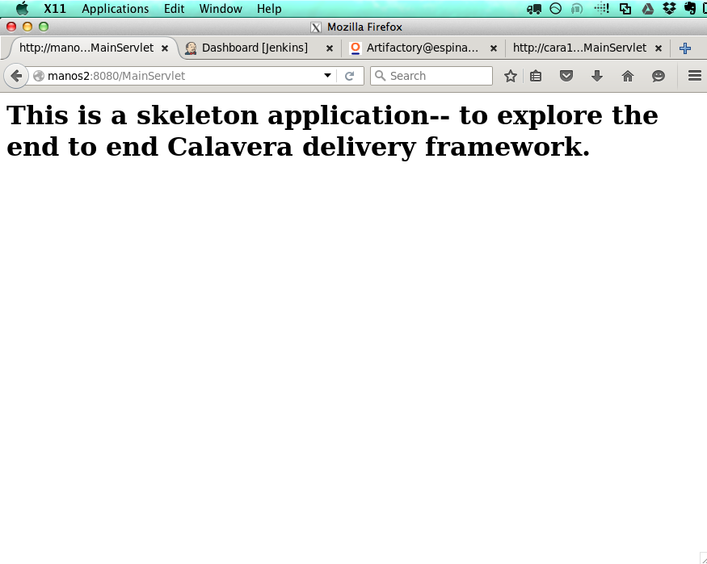
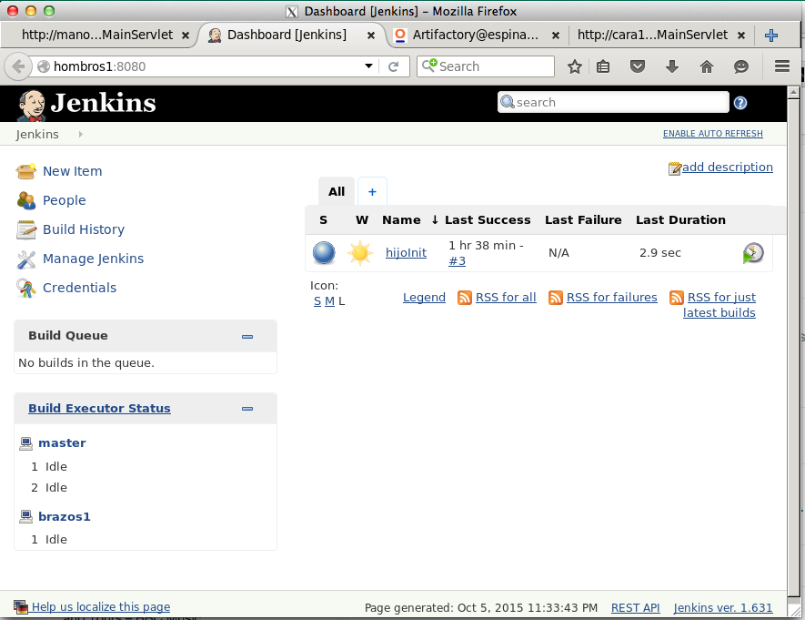
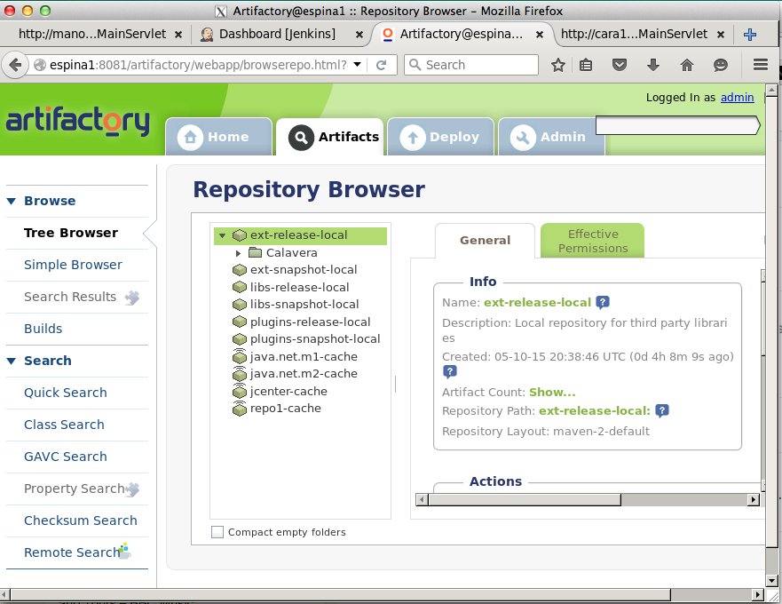
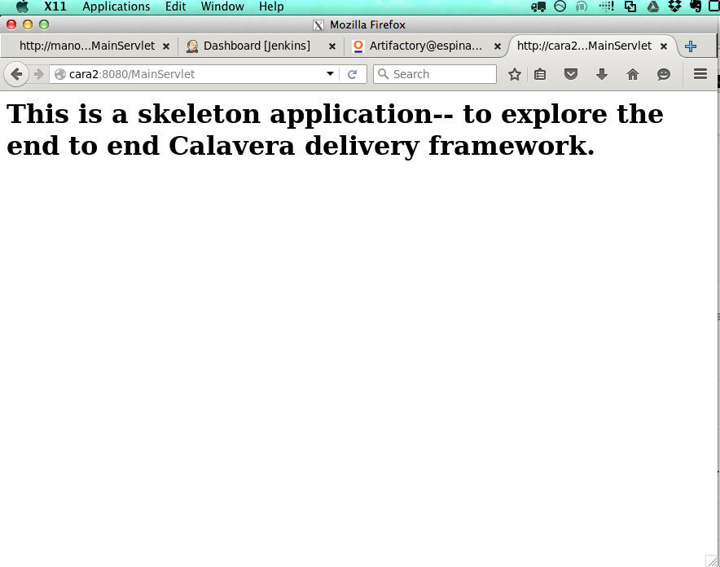
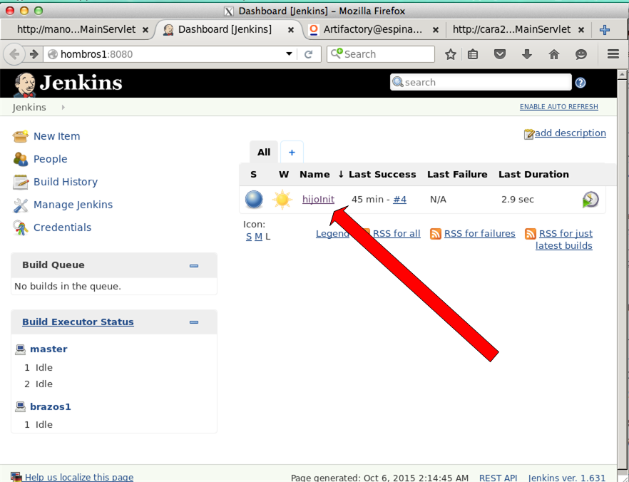
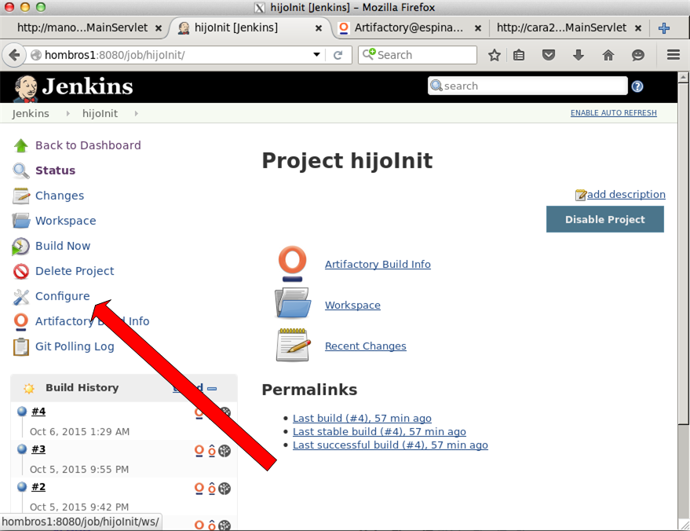
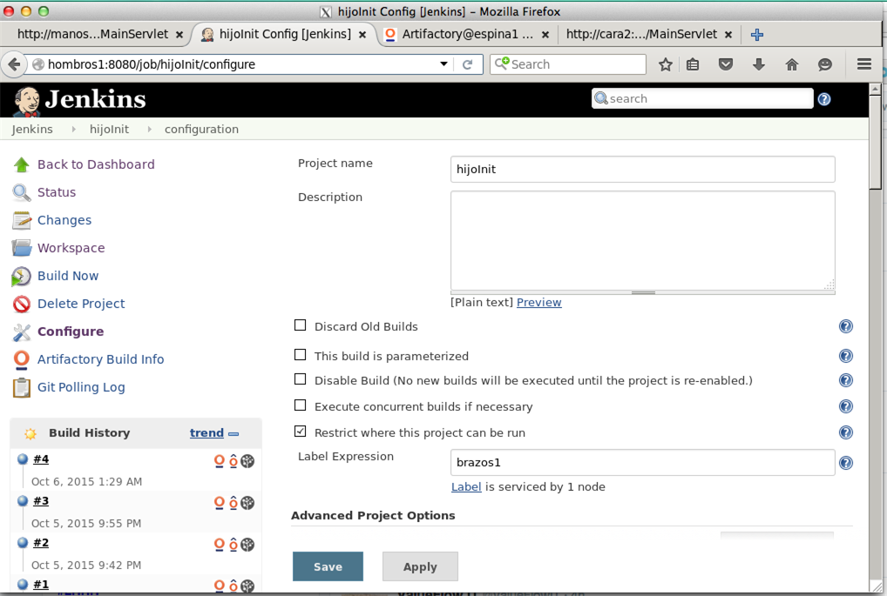
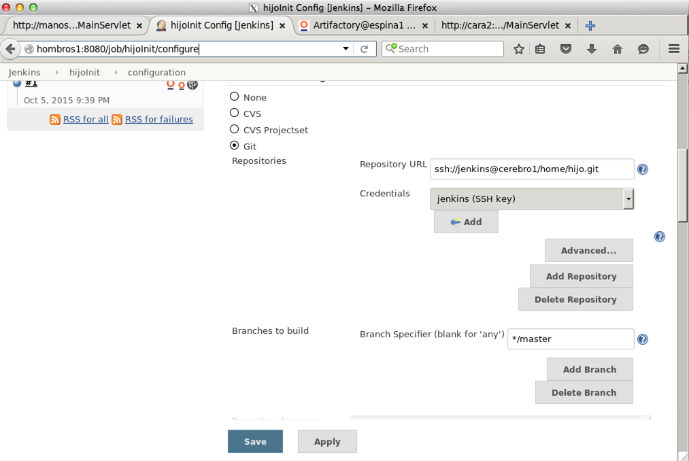
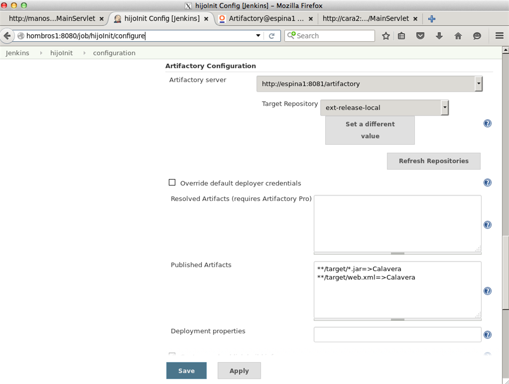

= Lab 04 (Technical) End to end DevOps-based software product management

== Understand the basic pipeline

=== Overview

In this lab, you will work as a team with an end to end DevOps pipeline.

*Lab objectives:*

* Examine the details of an end to end DevOps pipeline and participate in it using your development environment.

* Start to build a product pipeline, from ideation through delivery.

Now, before you get hands on, you need to define your team's roles. I suggest, but do not require, the following:

* Product owner (1)
* Business analyst (1-2)
* Developer (2 required)
* QA analyst (1)
* Tools specialist (1)

If you have a different idea, please discuss with me.

Consider taking turns in the roles.

You are now in 4 teams, each building a unique product. Your teams are numbered 1-4.

You will want two X-enabled sessions into the server (technically only one needs to be X enabled, but let's keep it simple). You will use your 2 sessions in this way:

* Session 1 will be for X-Windows, logged in with your student ID
* Session 2 will be for command-line operation, `su` logged in as one of the "publicxx" users. 

Four users have been set up:

* public1
* public2
* public3
* public4

The passwords are announced in class. You cannot ssh in as these users. Please do not attempt to configure ssh for them.

Instead, ssh in as yourself with BOTH your sessions.

=== X-windows session

Enable your local X client if needed (e.g. launch XMing). See https://github.com/dm-academy/aitm-labs/blob/master/Lab-00/00-tech-lab.adoc[Lab 00] for X-windows configuration.

In one session (as yourself) do

 $ firefox -no-remote

Firefox should open in X. Open four tabs, with the following URLS (substitute the xx as appropriate):

* manosxx:8080/MainServlet
* hombrosxx:8080
* espinaxx:8081
** log into Artifactory with the combination 'admin/password'
* caraxx:8080/MainServlet

Your tabs should look more or less like these:

Note that espina has been logged into and the tab switched to Artifacts where you can see the packaged Calavera artifacts.

Compare these to the Calavera architecture:

image::http://dm-academy.github.io/aitm/images/1.03-pipeline.png[]

****
Discuss: Why don't we open URLs to cerebro and brazos? What happens if you try? Why?
****

=== Terminal session

In your other session, do

`$ su publicxx`

where xx = 1 through 4, appropriate to your team.

Then:

....
$ cd ~/Calavera
$ vagrant ssh manosxx
....

where "xx" is your team number.

NOTE: While we use 'xx' to represent your team #, there is no leading zero. So, for example, Team 1 would `vagrant ssh manos1`, *not* `manos01`.

=== Try it out!
You are going to make a change, test it out locally, commit it to git locally, and then push it to the central repository (cerebro). When you do this, it will trigger a remote build and test, and you will see on the Jenkins dashboard whether it succeeded or failed. You will be doing DevOps!

IMPORTANT: Well, at least, you will be exercising an end to end automated build toolchain. We'll leave it for the purists to argue whether this is "doing DevOps."

Logged in manosxx as publicxx, refer back to https://github.com/dm-academy/aitm-labs/blob/master/Lab-03/03-tech-lab.adoc[lab 03] and change the MainServlet.java message again.

Rebuild the application (`sudo ant`)

You should be able to refresh your Firefox tab *for manosxx* and see your change.

Commit your change to git locally:

....
vagrant@manos1:/home/hijo$ git add . -A
vagrant@manos1:/home/hijo$ git commit -m "my first change"
[master 7787dd4] my first change
 1 file changed, 1 insertion(+), 1 deletion(-)
vagrant@manos1:/home/hijo$ git push origin master
Counting objects: 15, done.
Compressing objects: 100% (6/6), done.
Writing objects: 100% (8/8), 685 bytes | 0 bytes/s, done.
Total 8 (delta 1), reused 0 (delta 0)
remote:   % Total    % Received % Xferd  Average Speed   Time    Time     Time  Current
remote:                                  Dload  Upload   Total   Spent    Left  Speed
remote: 100    30  100    30    0     0   1676      0 --:--:-- --:--:-- --:--:--  1764
remote: Scheduled polling of hijoInit
To ssh://cerebro1/home/hijo.git
   17751d3..7787dd4  master -> master
vagrant@manos1:/home/hijo$
....

The last command is likely unfamiliar. What is it?

=== Understanding the integrations

Look again at the Calavera architecture:

image::http://dm-academy.github.io/aitm/images/1.03-pipeline.png[]

See the arrow going from "local git" to "Source repo "Cerebro""? When you push to "origin master" you are taking your local commit and replicating it to the master repository on cerebro, where other developers may pull it down to their workstations.

The first part of the response is just a report on transmitting the data, not very interesting:
....
Counting objects: 15, done.
Compressing objects: 100% (6/6), done.
Writing objects: 100% (8/8), 685 bytes | 0 bytes/s, done.
Total 8 (delta 1), reused 0 (delta 0)
remote:   % Total    % Received % Xferd  Average Speed   Time    Time     Time  Current
remote:                                  Dload  Upload   Total   Spent    Left  Speed
remote: 100    30  100    30    0     0   1676      0 --:--:-- --:--:-- --:--:--  1764
....

But the second part is more interesting:

....
remote: Scheduled polling of hijoInit
To ssh://cerebro1/home/hijo.git
   17751d3..7787dd4  master -> master
vagrant@manos1:/home/hijo$
....

What is this? It is a _githook_.

We can see the githook on cerebroxx, if we were to log in to it (don't bother right now). If we did so, we could see:

 $ cat /home/hijo.git/hooks/post-receive
 (some comments)
 curl http://hombrosxx:8080/git/notifyCommit?url=git@cerebroxx:/home/hijo.git

Have a look at the curl command. What is it doing?

This bit of code tells git (running on cerebro), *when it detects a new commit to the hijo repository,* to reach out over a standard Web connection to the hombros server, and to pass the URL parameter 'git@cerebroxx:/home/hijo.git' to the notifyCommit resource.

Discuss with your team what this does and how it works. In particular, review what the hombrosxx server does.

=== A first look at Jenkins

So, when hombrosxx receives the call from the githook, how does it know what to do? Go to your X-windows Firefox, and open the hombros tab with the Jenkins GUI.

Click on the hijoInit link. This represents the build job that is launched via the githook.

Click on the Configure link:

There are a lot of settings of the next page. The upper section is basic info for the project:

Further down, we see:

See the "Repository URL" section. Note the cerebro address.

Towards the end, we see:

In this section, the connection to Artifactory is configured. As part of the job, if it succeeds, the built files are moved to the package repository where they can be deployed to downstream environments.

Take your time and inspect all the configurations. This pipeline, which is as simple as a DevOps pipeline can be, is still remarkably complex.

By this point, Jenkins' centrality should be clear. However, on this first pass through the architecture, there is one more step, that of deployment.

At this time, we are not doing full Continuous Deployment in the lab, as it's not clear that this is always a best or desirable practice. You develop on manos, check into cerebro, and if all tests pass you have a newly built package in espina ready for deployment, but the actual deployment still requires one more positive step. Going back to your ssh session:

....
 vagrant@manos1:~$ exit
logout
Connection to 127.0.0.1 closed.
public1@srvXXX:~/Calavera$ vagrant reload --provision cara1
==> cara1: Loading Berkshelf datafile...
....

Usually, vagrant is not used to run production systems, but by typing `vagrant reload --provision` you force chef to check if the deployed packages are up to date. Since you have had (presumably) a successful Jenkins build since the last provisioning, the deployed .jar files on caraxx are *not* up to date, and will be replaced by the most recent files in Artifactory. Go to firefox and check, once the reprovisioning process is complete. The change you made and committed above should now be visible in caraxx, our "production" system.

== Further exercises

****
*Instructor's note*

We are going to enter into a more creative phase of the class. This class is itself a product and I am looking for feedback on the lab experience and platform. You now have a workable set of tools similar to an industrial environment, and I want to let you determine to some degree what you are interested in.
****

Here are some ideas for the remainder of the evening (please stay for the full class). Think about what you'd like to learn over the next 2-3 labs.

=== Product suggestions
Start developing a product identity. As a team, develop some simple product ideas. These can be very basic things like:

* Display a mascot or brand for your team
* Take a person's name and say "Hello" back to them
* Perform simple math calculations

Take a LIMITED amount of time and come up with 3-5 such features that your developers think they can implement.

=== Development suggestions
* Break your build
* Revert back to a known good version
* Experiment with Javascript for implementing simple logic on the page
* Features must have tests.
* What would it take to set up a database and integrate it with your Java?

IMPORTANT: Any source code you check into local git on manosxx or central git on cerebroxx is not backed up, unless you take steps to do so.

=== Toolchain suggestions
* Look at all aspects of the pipeline. Don't be afraid to experiment. It's yours and if you break it we will just rebuild it.
* Learn to rebuild part or all of your development pipeline
* Trace a configuration setting in the pipeline back to the Chef recipe that specified it.
* Figure out how to replicate any code you write in the pipeline to Github (it is not backed up otherwise).
* Help the developers set up a database.
