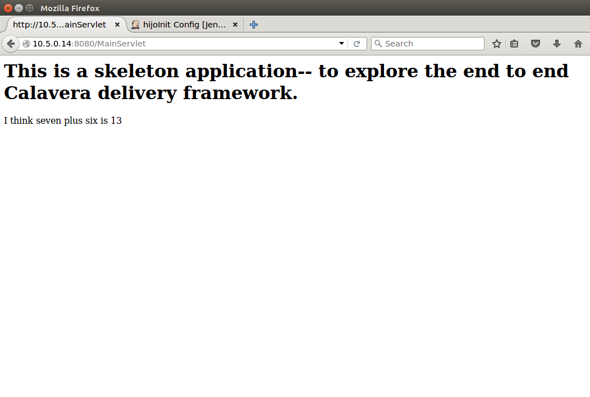

= Lab 05 Work Management: Kanban and further use of git.
In this lab, you will extend the pipeline to support Kanban work management coupled with further git techniques.

Lab objectives:

* Develop a manual Kanban board and convert it to an automated system.
* Learn the basics of git feature branching workflow.
* Add at least 10 small features to your product, using your team's agreed end to end workflow.

As in https://github.com/dm-academy/aitm-labs/blob/master/Lab-04/04-tech-lab.adoc[Lab 04], it is recommended you have 2 terminal sessions open, one for X windows, the other for product development.

== Manual Kanban

Using either whiteboards or large Post-it sheets, create a kanban board for your team/product. The precise structure is up to you, but it should include:

* Incoming feature work & todos
* Story development
* Feature development
* Testing
* Deployment

Each column is "owned" by the appropriate person on your team, from the organizing you did in https://github.com/dm-academy/aitm-labs/blob/master/Lab-04/04-tech-lab.adoc[Lab 04].

Use small Post-its for the features as they move from left to right.

[cols="2*", options="header"]
|====
|Kanban column |Owner
|Incoming feature work & todos |Product owner
|Story development | Business analyst
|Feature development |Developer
|Testing | QA analyst
|Deployment | Tools specialist
|====

Start with this sequence as a baseline. Understand you may adapt it; please be prepared to share your reasoning if you do.

* Product owner conceives high level idea
* Business analyst writes story
* Developer adds a new feature (addition example)
* Developer asks qa to approve (manual pull request)
* QA person commits it to master
* Tools person moves it to production (via cara reprovision)

You are to do this multiple times. Add AT LEAST 10 additional features (each at least some words and an object result - see example below) to the generated web page, considering each one as a feature.

Do  5 features manually and 5 features with an automated kanban tool.

The first time you go through this, the entire team should go through each step, with the appropriate team member leading the activity.

After that, you may be able to accelerate things. This is where some self-organization comes in. Do not use the suggested team structure as a cage. You will find the developers likely have the most work work. How can you all work together to deliver more quickly?

== Git feature branch, with Java example.

IMPORTANT: Although branching workflow in a development organization would be mainly the concern of dev, qa & tools, the entire team should understand this section - you are all accountable as individuals to know this material.

You need to elaborate your git branching strategy so that features have their own branches, and you can have more than one developer working at a time.

Read as a team these two sections on git workflows:

* https://www.atlassian.com/git/tutorials/comparing-workflows/centralized-workflow[Centralized Workflow]
* https://www.atlassian.com/git/tutorials/comparing-workflows/feature-branch-workflow[Feature Branch Workflow]
(It is not required to read the further sections on Gitflow or forking workflow, but you may wish to do so for your own professional development. Source workflow is a critical topic for digital organizations and the examples here are only the simplest.)

We have been doing the centralized git workflow. For this lab you are to work with the feature branch workflow approach.

NOTE: We do not have a capability for automated git pull requests within Calavera. (We do not use Github *within* Calavera. We just use plain git.)

Therefore, your pull requests will have to be handled manually in your Kanban workflow. More below.

=== Identify a new feature
Your product feature idea can be extremely simple. Some good starter examples would be,

* Display the team name
* Add two numbers together
* Display a given irrational number to 10 places

Write the idea down, with appropriate detail. For this lab, keep it simple. You might want to have two attached sticky notes: one identifying the task, and the other to actually carry the idea to the BA.

Product owner, your Kanban task is now ready for the business analyst - it meets the definition of done. Do not pull anything more into your queue until this task has been pulled ahead. Instead, if it takes them more than a few minutes to pull your task, go help folks downstream clear their lane.

=== Write a new story
As BA, you should formalize the story more:

"As a user of the website, I want to see two numbers added together so that I have that information."

"As a user of website, I want to see a greeting that is meaningful so that I know which team's site I am accessing."

"As a user of the website, I want to see the number pi displayed to 10 places so that I may have that knowledge."

Business analyst, once it is written in this form, your Kanban task is now ready for QA - it meets the definition of done. Do not pull anything more into your queue until this task has been pulled ahead. Instead, go help folks clear their lane.

=== Develop the new feature

Developer, pull the story from the BA into your queue.

Here we will create a new feature development branch by using the `git checkout -b some-feature master` command.

(You will give your feature a name appropriate to your new feature)

Go:

 :~/Calavera$ vagrant ssh manos5
 vagrant@manos5:~$ cd /home/hijo
 vagrant@manos5:/home/hijo$ git checkout -b feature/add-numbers master
 Switched to a new branch 'add-numbers'

You have added a new branch and switched to it. You can test this:

....
vagrant@manos5:/home/hijo$ touch x
vagrant@manos5:/home/hijo$ git add x
vagrant@manos5:/home/hijo$ git commit -m "testing new branch"
[add-numbers 3437d8e] testing new branch
 1 file changed, 0 insertions(+), 0 deletions(-)
 create mode 100644 x
vagrant@manos5:/home/hijo$ ls
build.xml  src  target  x
vagrant@manos5:/home/hijo$ git checkout master
Switched to branch 'master'
vagrant@manos5:/home/hijo$ ls
build.xml  src  target
vagrant@manos5:/home/hijo$ git checkout add-numbers
Switched to branch 'add-numbers'
vagrant@manos5:/home/hijo$ ls
build.xml  src  target  x

....

See how that works? The file "x" is visible in the "add-numbers" branch, but not in the master branch. Delete it:

 vagrant@manos5:/home/hijo$ rm x

IMPORTANT: The java files resulting from this lab can be referenced in its https://github.com/dm-academy/aitm-labs/tree/master/Lab-05[Github folder].

Now, let's write a test. (You should always write the test first in test driven development.)

 vagrant@manos5:/home/hijo$ nano src/test/java/biz/calavera/TestClass1.java

In nano, at the end of the code but *before the last brace "}"*, add

....
public void testSum() {
                assertEquals("two numbers sum OK", 10, this.a.sum(5, 5));
              }
....

and save. Build it:

....
 vagrant@manos5:/home/hijo$ sudo ant
 Buildfile: /home/hijo/build.xml

 init:
      [echo]

[---deleted lines---]

 compile:
     [javac] Compiling 2 source files to /home/hijo/target
     [javac] Compiling 1 source file to /home/hijo/target
     [javac] /home/hijo/src/test/java/biz/calavera/TestClass1.java:41: error: cannot find symbol
     [javac] 			assertEquals("two numbers sum OK", 10, this.a.sum(5, 5));
     [javac] 			                                             ^
     [javac]   symbol:   method sum(int,int)
     [javac]   location: variable a of type Class1
     [javac] 1 error

 BUILD FAILED
 /home/hijo/build.xml:68: Compile failed; see the compiler error output for details.

 Total time: 1 second
....

Unsurprisingly, the build broke. You wrote a test and no implementation. Let's implement the feature:

 vagrant@manos5:/home/hijo$ nano src/main/java/biz/calavera/Class1.java

At the end, before the last brace, add:

....
public int sum(int int1, int int2)
{
      return int1+int2;
}
....

Exit nano; you can now `sudo ant` and it should work.

NOTE: Experienced people will note that the MainServlet java class is not being tested. This is possible, but gets complex - see http://stackoverflow.com/questions/12945907/how-to-mock-the-httpservletrequest and related links.

Let's display your new functionality to the world:

 nano src/main/java/biz/calavera/MainServlet.java

Add to the indicated location the last line in the following block:
....
Class1 oResp = new Class1(message);
out.println(oResp.webMessage());
out.println("I think seven plus six is " + oResp.sum(7,6));
....

NOTE: Notice that we tested 5+5, but for the actual application we are using 7+6. This is deliberate.

NOTE: You can keep adding `out.println`("my text") lines to MainServlet.java, in the `public void doGet method`, for new features. They all display on the same page.

Rebuild and redisplay. You should see the phrase,

"I think seven plus six is 13"

added to your web page.

Now that it is working, stage and commit the changes:

....
vagrant@manos5:/home/hijo$ git add . -A
vagrant@manos5:/home/hijo$ git commit -m "sum feature"
[add-numbers ba34954] sum feature
 4 files changed, 9 insertions(+), 2 deletions(-)
 delete mode 100644 x
....

NOTE: `git add . -A` is a lazy way of adding all the files you've worked on in the directory. You also can add them one by one by names (e.g. `git add path/to/myfile.java`) if you are changing several things at once but only want to commit some of them.

*Reminder: the person leading the lab at this point should be the developer.*

If your feature is passing your tests, you can push it to origin, but NOT master. As suggested in the Atlassian web tutorial, push it to your feature branch, in this case "add-numbers":

....
vagrant@manos5:/home/hijo$ git push origin add-numbers
Counting objects: 29, done.
Compressing objects: 100% (10/10), done.
Writing objects: 100% (17/17), 1.34 KiB | 0 bytes/s, done.
Total 17 (delta 4), reused 0 (delta 0)
remote:   % Total    % Received % Xferd  Average Speed   Time    Time     Time  Current
remote:                                  Dload  Upload   Total   Spent    Left  Speed
remote: 100    30  100    30    0     0   1918      0 --:--:-- --:--:-- --:--:--  2000
remote: Scheduled polling of hijoInit
To ssh://cerebro5/home/hijo.git
 * [new branch]      add-numbers -> add-numbers
vagrant@manos5:/home/hijo$
....

Now, here is a tricky question.

Look at your Jenkins console. Why didn't the build run? Investigate the hijoInit configuration. Don't move on until you see why.

Developer, your Kanban task is now ready for QA - it meets the definition of done. Do not pull anything more into your queue until this task has been pulled ahead. Instead, go help folks downstream clear their lane.

=== Test the new feature

NOTE: In this section, we will create an additional repository for the QA person, who becomes the collaborative development partner (like Bill in the Atlassian writeup).

QA, once you have received the task from the developer:

Starting as your public ID, log into manos:

 :~/Calavera$ vagrant ssh manos5

Create a new directory for your own personal use.

NOTE: In a real environment, you would likely do this on your own VM. This is a small compromise to prevent us setting up a QA VM. I may do so in the future.

Go:

....
vagrant@manos5:/home$ sudo mkdir /home/QA
vagrant@manos5:/home$ sudo chmod 777 /home/QA
vagrant@manos5:/home$ cd /home/QA
vagrant@manos5:/home/QA$ git clone ssh://cerebro5/home/hijo.git
Cloning into 'hijo'...
remote: Counting objects: 35, done.
remote: Compressing objects: 100% (21/21), done.
remote: Total 35 (delta 4), reused 0 (delta 0)
Receiving objects: 100% (35/35), 5.24 KiB | 0 bytes/s, done.
Resolving deltas: 100% (4/4), done.
Checking connectivity... done.
vagrant@manos5:/home/QA$ cd hijo/
vagrant@manos5:/home/QA/hijo$ tree
.
├── build.xml
├── src
│   ├── main
│   │   ├── config
│   │   │   └── web.xml
│   │   └── java
│   │       └── biz
│   │           └── calavera
│   │               ├── Class1.java
│   │               └── MainServlet.java
│   └── test
│       └── java
│           └── biz
│               └── calavera
│                   └── TestClass1.java
└── target
    └── web.xml

11 directories, 6 files

vagrant@manos5:/home/QA$ cat src/main/java/biz/calavera/Class1.java
package biz.calavera;

public class Class1 {
          String strMsg;

          public Class1 (String inString)
          {
                    strMsg = inString;
          }
        public String five()
        {
                return "five";
        }

          public String webMessage()
          {
              return "<h1>" + strMsg + "</h1>";
          }

        }

....

What's this? Where are the new changes? Go:

....
vagrant@manos5:/home/QA/hijo$ git show-branch
[master] initial commit
....

Ok, we're on the master branch. What other branches are there?

....
vagrant@manos5:/home/QA/hijo$ git show-branch -a
* [master] initial commit
 ! [origin/HEAD] initial commit
  ! [origin/add-numbers] sum feature
   ! [origin/master] initial commit
----
  +  [origin/add-numbers] sum feature
  +  [origin/add-numbers^] testing new branch
*+++ [master] initial commit
....

Ah, the developer said  I needed to be on the add-numbers branch.

....
vagrant@manos5:/home/QA/hijo$ git checkout add-numbers
Branch add-numbers set up to track remote branch add-numbers from origin.
Switched to a new branch 'add-numbers'

vagrant@manos5:/home/QA/hijo$ cat src/main/java/biz/calavera/Class1.java
package biz.calavera;

public class Class1 {
          String strMsg;

          public Class1 (String inString)
          {
                    strMsg = inString;
          }
        public String five()
        {
                return "five";
        }

          public String webMessage()
          {
              return "<h1>" + strMsg + "</h1>";
          }

          public int sum(int int1, int int2)
          {
		return int1+int2;
	  }

        }
....

There's the new feature.

Thinking of yourself as the QA person, execute the following tests:

Review the code changes they have made. Go:

....
vagrant@manos5:/home/QA/hijo$ git diff master add-numbers src/main/java/biz/calavera/Class1.java
diff --git a/src/main/java/biz/calavera/Class1.java b/src/main/java/biz/calavera/Class1.java
index ff93f47..9484653 100644
--- a/src/main/java/biz/calavera/Class1.java
+++ b/src/main/java/biz/calavera/Class1.java
@@ -18,5 +18,9 @@ public class Class1 {
               return "<h1>" + strMsg + "</h1>";
           }

+          public int sum(int int1, int int2)
+          {
+               return int1+int2;
+         }

         }
diff --git a/src/main/java/biz/calavera/MainServlet.java b/src/main/java/biz/calavera/MainServlet.java
index f05d53b..1489918 100644
--- a/src/main/java/biz/calavera/MainServlet.java
+++ b/src/main/java/biz/calavera/MainServlet.java
@@ -30,7 +30,7 @@ public class MainServlet extends HttpServlet {

               Class1 oResp = new Class1(message);
              out.println(oResp.webMessage());
-
+              out.println("I think seven plus six is " + oResp.sum(7,6));
          }

          public void destroy()
diff --git a/src/test/java/biz/calavera/TestClass1.java b/src/test/java/biz/calavera/TestClass1.java
index 0c4c49c..226cbca 100644
--- a/src/test/java/biz/calavera/TestClass1.java
+++ b/src/test/java/biz/calavera/TestClass1.java
@@ -36,5 +36,8 @@ public class TestClass1 {
                     assertEquals("five is 5", "five", this.a.five());  //a.five = "five"
                     assertEquals("string correctly generated", "<h1>TestWebMessage</h1>", this.a.webMessage());
        }
-
+
+       public void testSum() {
+                       assertEquals("two numbers sum OK", 10, this.a.sum(5, 5));
+       }
 }
END
....

(Type "q" to continue.)

This shows you the differences in the three changed files, across the two branches. You can also do it for just one file at a time, by passing in the path & name of the file - try this.

Re-build the application (you can run `sudo ant`). Note that when you do so, you replace whatever has been built and deployed to the local Tomcat instance (as above, we'll probably put in a new pipeline node for manual QA in the future.) Examine the web page output; it should look like:

When you are satisfied, you can push to master:

....
vagrant@manos5:/home/QA/hijo$ git checkout master
Switched to branch 'master'
Your branch is up-to-date with 'origin/master'.
vagrant@manos5:/home/QA/hijo$ git pull
Already up-to-date.
vagrant@manos5:/home/QA/hijo$ git pull origin add-numbers
From ssh://cerebro5/home/hijo
 * branch            add-numbers -> FETCH_HEAD
Updating e0fab6d..ba34954
Fast-forward
 src/main/java/biz/calavera/Class1.java      | 4 ++++
 src/main/java/biz/calavera/MainServlet.java | 2 +-
 src/test/java/biz/calavera/TestClass1.java  | 5 ++++-
 3 files changed, 9 insertions(+), 2 deletions(-)
vagrant@manos5:/home/QA/hijo$ git push origin master
Total 0 (delta 0), reused 0 (delta 0)
remote:   % Total    % Received % Xferd  Average Speed   Time    Time     Time  Current
remote:                                  Dload  Upload   Total   Spent    Left  Speed
remote: 100    30  100    30    0     0   2109      0 --:--:-- --:--:-- --:--:--  2142
remote: Scheduled polling of hijoInit
To ssh://cerebro5/home/hijo.git
   e0fab6d..ba34954  master -> master
vagrant@manos5:/home/QA/hijo$
....

Notice we did a "git pull," that resulted in "Already up-to-date." In a busy development environment, that might easily not be the case.

****
*Developers note:*

Doing anything more ambitious with the Java (generating Javascript, adding classes, etc) is strictly extra credit. Don't distract yourself with getting too technical. But have fun.

You should continue using test-driven development however.

Also feel free to visit the other teams and borrow anything interesting they have done.
****

IMPORTANT: At this writing, I would appreciate a basic Javascript approach that would allow the web site consumer to enter simple data (integers and strings), in a manner consumable by the supporting Java code.

QA, your Kanban task is now ready for deployment - it meets the definition of done. Do not pull anything more into your queue until this task has been pulled ahead. Instead, go help folks downstream clear their lane.

=== Deploy to production
The tools team now pulls the task into their queue. Their job is easy. As publicXX, go:

`~/Calavera$ vagrant reload --provision caraxx`

and after a few minutes the new production website should appear, identical to the QA screenshot above.

Time to define some of your own features! Do 4 more manually and move to the next section.

As you move forward with more features, consider that you have all the skills not just for separate dev & QA, but for two different developers as well. You can certainly set up a third directory, e.g/ home/hijo2, in the same way as the QA directory. It's up to you as you self-organize.

== Automated Kanban
Once you have developed at least 5 features with your manual Kanban board, switch to an online SaaS tool. (Consider the section in the AITM textbook, http://dm-academy.github.io/aitm/#_the_shared_mental_model_of_the_work_to_be_done"[Time and Space Shifting."])

For the Fall 2015 lab, Teams 1 and 2 will use https://trello.com/[Trello].
Teams 3 and 4 will use https://tree.taiga.io[Taiga].

The Cloud-based SaaS sites have extensive instructions and do their best to make it easy. Therefore, this lab does not provide step by step instructions. For both Taiga and Trello, your team lead should sign up first and create the team, and then invite the other members. I have tested that this works for both systems.

Part of the learning in this lab is climbing the learning curve for these applications. We will work through any issues in class and I will update the lab with more details if required.

Once you are provisioned with the online tool, you should use your manual Kanban board as a basis and adapt the online system for your team.

There are many ways you might automate the interaction of the kanban tool, git, Slack, and other parts of the pipeline. At a minimum, you should be using the Kanban tool to communicate the branch ID. Some tools automatically generate a new branch when the developer pulls the story.

Finally, once you have moved features through the automated tool, discuss: how do you like the manual vs automated kanban approach?

== Optional: saving your code to Github
Anything you develop on the course server is subject to deletion. (I will try to give warning.) If you want to save anything, save it to your Github account. The instructions are here:

https://help.github.com/articles/adding-a-remote/

You will need to name your remote something *other* than "origin," e.g. "my-lab-05."

Note that you can save work in this way to more than one team member's account.

Good job on finishing yet another lab. Next week: operations & monitoring.
