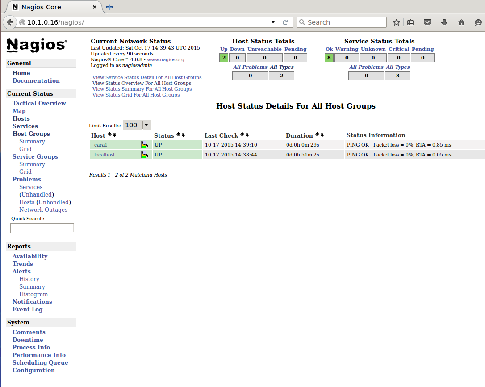
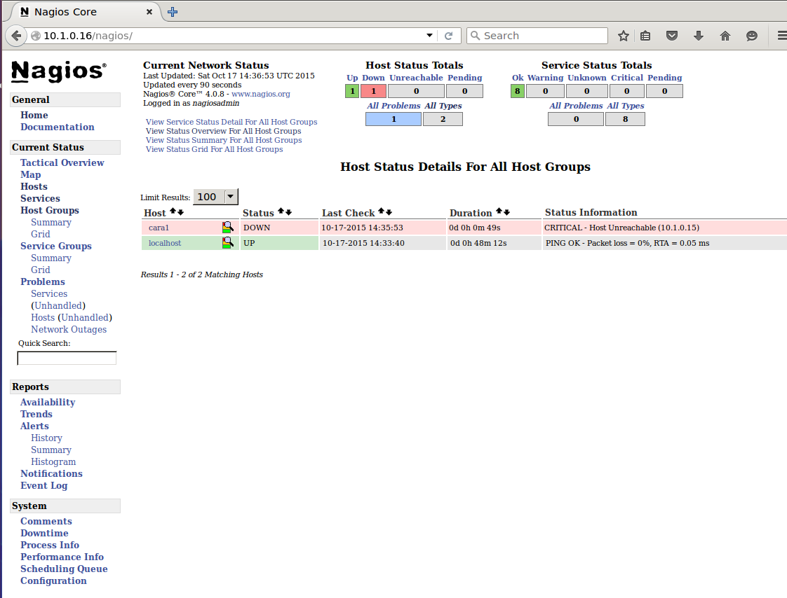

= Lab 06 Configuring Nagios monitoring

Version 2 - for fan in/out model.

Each team of 2 gets their own monitoring server, which is not the most realistic scenario but gives everyone experience in a complex install and configuration process.

The monitoring servers will all monitor the primary pipeline and the cara03 server.

== Introduction
In this cumulative lab, you will assemble into your teams and install the open source monitoring tool Nagios in a client-server configuration.

The objectives of this lab are to gain a basic understanding of monitoring tools and techniques, and further develop your systems management skills through installing and configuring a distributed Linux system with *less prescriptive guidance than you have had to date.* This lab is much more about what, not how.

IMPORTANT: This lab may take you more than this class time. Use Slack to continue collaborating as a team. Do NOT let one person carry the load. All should be involved. Senior people, please keep your team involved.

IMPORTANT: As will be repeated below, you can either run an automated script or follow manual steps to do this lab.

== Getting started
****
*Some notes on working as pairs or a group*

It is important that you all track what is happening on the console. Take turns operating the keyboard. Each command should be discussed and everyone should be aware that a new command is being issued. It is not acceptable to have the strongest technologist in the group simply do the work.

Although you will be graded as a group on this assignment, questions regarding it will appear on your individual quizzes and the final. *The next quiz and the final will have some very deep dive questions on this lab.* So you *all* need to understand what is being done.

Support each other as teams. Use Slack.
****

NOTE: The names nervios and Nagios are confusingly similar. Nagios is the open source monitoring software; nervios is the server. This was initially accidental, but I kept it this way because you will encounter similar situations in the real world, and you need to be careful and precise.

=== Change the Vagrantfile
These instructions assume comprehensive familiarity with Unix commands and operations. Literal instructions are limited.

`ssh -YC` into the server.

`su` to the public1 ID; password given in class.

`cd ~/VMs/XX` (re-used from previous)

* If there is already a Vagrantfile, go:

 mv Vagrantfile Vagrantfile.old

* Copy `~/Calavera/lab-06-Vagrantfile` to the directory you just created, giving it the name `Vagrantfile`. (you can save your old one as Vagrantfile.old if you want).

* `nano` ~/VMs/XX/Vagrantfile and do the following:

** Search replace on the nervios00 name and change it to nerviosXX.
** Change the "90" in your IP to 90 + your #
** Change the ports
*** guest: 22, host: 2190 + your # (e.g, 2190 + 18 = 2208)
*** guest: 80, host: 8190 + your #
*** guest: 8080, host: 9190 + your #

The goal is to

* install the LAMP stack on your nerviosXX instance
* install the Nagios server on your nerviosXX instance
* configure Nagios to monitor servers in the pipeline
* confirm that the pipeline is being monitored
* test monitoring by halting one or more servers and observing the result
* expand monitoring to cover Apache Tomcat on the cara1 server, and Jenkins on hombros1.
* test the expanded monitoring

NOTE: As of Spring 2017, due to server capacity issues, this lab will have many nerviosXX servers monitoring the main pipeline. Do not launch your own caraXX servers.

=== Steps
WARNING: READ THIS ENTIRE LAB CAREFULLY BEFORE STARTING. IF YOU JUST LAUNCH INTO THE STEP BY STEP INSTRUCTIONS YOU WILL REGRET IT WHEN YOU GET A FEW PARAGRAPHS FURTHER. BE SURE YOU UNDERSTAND EVERYTHING.

* `vagrant up nerviosXX` where nerviosXX is your number.

The instructions we will follow this time are at:

http://www.unixmen.com/install-configure-nagios-4-ubuntu-14-1014-04/

Notice that this script in turn points to a LAMP installation.

WARNING: If you follow the LAMP installation, do NOT install mariadb. This means there is a long section in the instructions you just ignore. I have tested the lab only with mysql, so I recommend you use that.

At this point, you should have the command line skills to install and configure nagios based on these directions, which will not be repeated or elaborated here.

*At your own option*, you may choose to use the https://github.com/dm-academy/Calavera/blob/master/cookbooks/nervios/files/nervios.sh[nervios.sh] script, which installs both LAMP and Nagios.

You will need to copy this script into your ~/VMs/XX directory, when you are logged in as public1. it is at ~/Calavera/cookbooks/nervios/files/nervios.sh.

(You really didn't want to install everything manually and then find out there was  a nice script, did you?)

NOTE: You *must* `sudo` the script.

If you can't `cd /home/nerviosxx/cookbooks/nervios/files/`, something is wrong. What?

If you can't sudo the script, what is wrong?

You should examine this script carefully and compare it to the online directions. This script is not a "lights-out" script; you will need to watch the console and select various options per the instructions.

I have tested this script repeatedly across 2 semesters. _I offer no guarantees that it will work for you._

In particular you will need to select some passwords, which can be simple ones,  or even blank. *MAKE NOTE OF ALL YOUR PASSWORDS*. We will be tearing these pipelines down and they are only available from inside the main course server, which is externally secured.

What does it mean if you get permission denied when you try to execute the script? There are at least two possible reasons. Search previous labs if you get this.

Whether you follow the instructions manually or run the script, here are the interactive prompts in the install process:

. mysql-server password first request (can be blank)
. mysql-server password second request (can be blank)
. mysql-server password third request (can be blank)
. Configuring phpmyadmin: Select `apache2` by hitting Space bar, then Enter.
. Configuring phpmyadmin database: Select `<Yes>` by just hitting Enter.
. Phpmyadmin admin user password: can be blank.
. phpmyadmin database password: can be blank
. `Enter new Unix password:` use 'public'
. `New password:` use 'public' (this is the password to log into the Nagios website with)

WARNING: This is a sandbox system, well contained inside a hardened environment, with highly limited external access (ssh only). This is the ONLY case in which low security passwords are acceptable. Some might say they are never acceptable, and that this lab is encouraging bad habits. But you have a great deal of complexity you are confronting already and using simple or blank passwords reduces one failure mode in this challenging lab. A truly secure environment would not use passwords at all, but ssh or other technologies instead. This is beyond our scope here.

The script shows you the minimum of what needs to be done. There are various tests and optional features it does not do.

If you used the script, the install is done when you see:

....
To activate the new configuration, you need to run:
  service apache2 restart
Enabling module cgi.
To activate the new configuration, you need to run:
  service apache2 restart
 * Restarting web server apache2                                  [ OK ]
Starting nagios: done.
....

== Configure monitoring

At this point, you have either run the script or done the installation manually. You are at the point of the http://www.unixmen.com/install-configure-nagios-4-ubuntu-14-1014-04/[instructions] that say:

*Access Nagios Web Interface*

From this point, follow the instructions. Now is the time to open a second X window, if you have not already done so. Remember that you access Firefox from the main server when you are logged in as you. It will not work if you are su'd as public, nor ssh'd into your VM.

You can log in and see your nagios instance by opening a new ssh session into the server (NOT your VM!!) and typing

    firefox -X -no-remote

When the browser window appears, type in the URL: http://127.0.0.1:8xxx/nagios, where xxx is the port mapping for port 80 that you set in the Vagrantfile

  Login: nagiosadmin
  Password: public

Congratulations, you have the nervios server running Nagios.

Go to the  http://www.unixmen.com/install-configure-nagios-4-ubuntu-14-1014-04/[instructions] section that says:

*Add Monitoring targets to Nagios server*

Skip the section where you start nrpe. Go to the section that says _Now, go back to your Nagios server, and add the clients..._.

When you get to the part where you are editing

sudo nano /usr/local/nagios/etc/servers/clients.cfg

you should copy and adapt the configuration from https://github.com/dm-academy/aitm-labs/blob/master/Lab-06/clients.cfg.

****
*Host IPs*

You may need these.
....
10.1.0.10   cerebro1
10.1.0.11   brazos1
10.1.0.12   espina1
10.1.0.13   hombros1
10.1.0.14   manos1
10.1.0.15   cara1
....

****

In the http://www.unixmen.com/install-configure-nagios-4-ubuntu-14-1014-04/[Unixmen instructions], in the section "*Configure Monitoring Targets*," there is a small choice you can make, whether to put in the ip address of nerviosxx, or the actual hostname nerviosxx. Reading the notes in the configuration file, what do you think you should do? Will putting in the nerviosxx host name work? How can you find out?

NOTE: I am giving you what not how at this point, follow the instructions carefully and be careful of the address you use. If you give something a default host name of "client," that is what you will see in the console. Notice that host_name is not the same as address in the Nagios configuration.

I chose the Unixmen tutorial because it was a little more user friendly. The nagios quickstart is https://assets.nagios.com/downloads/nagioscore/docs/nagioscore/4/en/quickstart-ubuntu.html[here] and you should familiarize yourself with its documentation.

IMPORTANT: You need to substitute your target server name and IP in the configuration. *Will not work* if you use the default values suggested online.

=== Wiping and re-loading the nervios server
If your installation is fighting you, don't try to "fix" it. Servers are http://www.lauradhamilton.com/servers-pets-versus-cattle[cattle, not pets]. Go:

 vagrant destroy nerviosxx -f
 vagrant up nerviosxx

and start over from scratch. Trust me, it will be quicker.

=== Viewing Nagios

If you have followed the instructions correctly, it should start monitoring your cara instance.

From the main Nagios screen, click on the "Hosts" link to the right. You should see a screen with two hosts, like this:

Take a screen shot and post to Slack.

Test that your monitoring is working correctly by asking the instructor to suspend the cara server (we may have to coordinate this with the class as everyone is looking at the same server; hopefully people will arrive at this point at different times.)

In 5 minutes, you should see an error on the web portal, like this:

Take a screen shot; combine it with your previous screen shot (e.g. in Powerpoint or as a PDF) and post to https://seis660.slack.com/messages/lab-06[Slack].

When you have taken this screenshot, tell the instructor so he or she can re-launch cara.

You can change the speed with which Nagios detects a down server through a parameter change. At your option, research the https://assets.nagios.com/downloads/nagioscore/docs/nagioscore/4/en/objectdefinitions.html#host[instructions] and do so.

Now, configure monitoring for the rest of your pipeline. Note that nervios already monitors itself.

When you are done, post a screenshot of your pipeline being monitored to Slack.

NOTE: Nagios takes some time to restart monitoring correctly after a restart. Detecting a down server or service also takes time. Observe the "Last Check" and "Status Information" column carefully and compare it to the current time before you conclude that something's not working. When is the check scheduled? Maybe it needs a few more minutes. If you are getting impatient, add a check_interval and reduce the retry_interval and max_check_attempts for the host or service definition. See the https://assets.nagios.com/downloads/nagioscore/docs/nagioscore/4/en/objectdefinitions.html[documentation].

== Monitor services

Pinging servers to be sure they are up is a start, but we also need to monitor what they are doing. Reviewing the Unixmen and Nagios instructions, configure service monitoring for:

* SSH on all servers
* Tomcat on manos and cara (monitor http port 8080)
* Jenkins on hombros (monitor http port 8080)
* Artifactory on espina (monitor http port 8081)

In order to monitor HTTP with a given port, add

....
define command{
        command_name    check_http_port
        command_line    /usr/local/nagios/libexec/check_http -H $ARG1$ -p $ARG2$
        }
....

to your clients.cfg file. Then, define a service (as you did with SSH) and use the following:

 check_command             check_http_port!<IP>!<Port>

For example, to monitor tomcat on cara1:

 check_command              check_http_port!10.1.0.15!8080

To monitor Artifactory on espina3:

 check_command              check_http_port!10.3.0.15!8081

Yes, these directions are somewhat incomplete. You have to combine them with previous steps.

Review the https://assets.nagios.com/downloads/nagioscore/docs/nagioscore/3/en/monitoring-publicservices.html[Nagios instructions] for further understanding. What are the exclamation points all about? Discuss.

Git on cerebro is extra credit, 10 points to the team who figures it out.

The command to stop tomcat on a server is `sudo service tomcat6 stop`.

The command to start it is `sudo service tomcat6 start`.

Stop Tomcat on cara or manos, and take a screenshot showing that the service is down but the server is up.

We are not going to monitor services on brazos. Discuss why that might be in your team. We'll talk about it towards the end of class (please remind me).

Post a screen shot to https://seis660.slack.com/messages/lab-06/[Slack] showing the services being monitored.

****
*HINT*

It is always good to dig around in the lab folder on Github and see what else may be there to assist you. But if you didn't read the lab entirely at first per the instructions, you might have done more work than you needed.
****

== Extra credit: monitor capacity

As an extra credit project (15 points to each team member), monitor either CPU, RAM, or both using the Nagios agent. Post proof to Slack. You are on your own. I may ask each member of the team to show me how it was done, so don't just let your strongest technical person do it.

You are now complete with the first half of the course. The second half will be less technical. Congratulations. Be sure to review this lab thoroughly for the quiz, which will be difficult.
