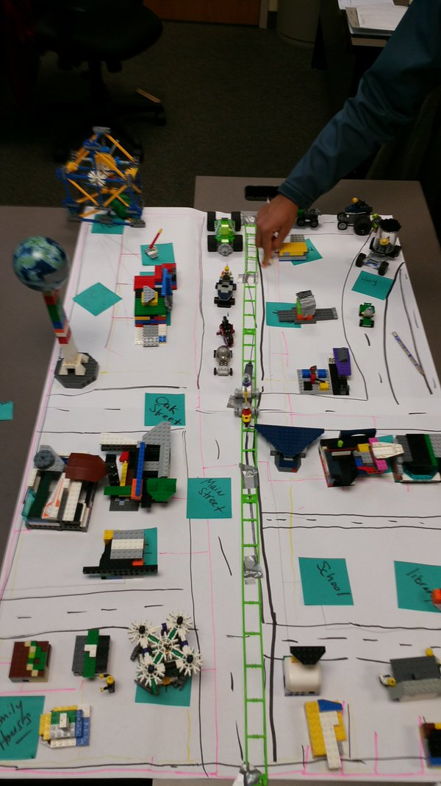

= Lab 07 IT Organization

== Supplies
* Large quantity of Legos, K'Nex, etc
* Large post-it sheets
* Small post-it notes
* Duct tape
* String/twine
* Name badges (? still thinking about this)
* Markers

== Introduction
Credit where due: this lab draws much inspiration from the work of Alexey Krivitsky with his http://www.lego4scrum.com/[Lego Scrum game]. However, the purpose of this game is not to teach Scrum, but rather illustrate various forms of matrix management.

IMPORTANT: These instructions are for the instructor conducting the lab. Lab participants should NOT read them before the lab, in the interest of the learning experience.

In this lab, which is not a technical lab, the class experiments with various http://dm-academy.github.io/aitm/#_the_continuum_of_organizational_forms[organizational forms].

The purpose of this lab is to understand through practical experience concepts including:

* Product teams
* Functional specialization
* Matrix management
* Organizational culture
* Styles of work
* Self-organization
* Collaboration and coordination

Framing: Instructor is product manager, and the "product" is a city.

There are four phases with 3 sprints each:

* Pure silos, with project management as expeditor
* Virtual project teams
* Pure product teams
* Product teams with guilds

Here is an illustration of a city in progress:

== Initial backlog
* Infrastructure (illustrated on 2-3 large Post-it sheets on a central table)
** Streets
** Bus stops
** Intersection(s) (can be drawn)
** Park (can be drawn)
** River (can be drawn)
** Bridge
* 1 & 2 Stories
** 20 - single family homes, one per sticky note
** 10 - apartment buildings
** 5 - shops (2 stories, usually on corner or on main drag)
* Civil & Commercial
** Utility plant (represents electric/water/telco, one line from it to each structure)
** 2 - factories
** Police station
** Gas station
** School
** Childcare (with fence and playground)
* Vehicles
** 3 trucks
** 3 buses
** 5 cars
** Rail

== Business rules

* There should be zones:

** Residential
** Commercial
** Industrial

* All buildings front onto a street.

* The utility plant should be built in the first iteration.

* Factories should have truck access and plan for rail access.

* All buildings need a utility line, which can either be string or drawn with marker.

== Starting

Thought experiment: Your startup was absorbed by a company that believes in functional silos.

The lab starts by dividing into 4 functional teams:

. Project planning & management
. Sourcing (finding parts)
. Assembly
. Integration

== Phase 1: Workcells w/expeditor
Learning objective: Transactional costs of silo approaches.

The project managers divide up the backlog (by the major bullets) and start by walking their work through the other 3 functional teams. Each PM should create a kanban sheet, very simple.

At this stage, roles are strictly enforced.

* Only sourcing people can take parts out of the parts bin
* Only assembly people can put them together
* Only integration people can move things over to the board
* Integration people also are responsible for any drawn infrastructure
* Only the PM can move the sticky note

Selection of work is indicated by moving selected backlog into the "doing" column. This is considered to be estimation. Sticky notes moved into the "doing" column must be completed by the sprint end.

In this model, the team is more or less anonymous to the project manager and operates on a "first come, first served" basis.

The project manager decides what is feasible to build.

The project manager goes to the sourcing team and requests a specific # of parts and moves them to the assembly team, and then to the integration team. The project manager must not touch the parts bin and can only take the parts s/he can carry in 2 hands. However, s/he can make multiple trips.

Only the project manager can communicate between the workcells. Workcell operators cannot communicate with each other.

3 x 10 minute sprints

== Phase 2: Virtual project team
Learning objective: Breaking down the silo boundaries. But people still orient around who they are sitting with.

In this model, people on each team are aligned to specific projects and can communicate with each other outside of the project manager. However, they still sit together in functional groups.

Project manager leads the planning, with input from the team (the team gathers temporarily around the kanban sheet)

3 x 10 minute sprints

== Break: Matrix exercise
Line up the attendees in columns corresponding to functional teams, with the project managers on one side.

Each row becomes a feature team. (Some doubling up will be required.)

Feature team 1	1 & 2 story buildings
Feature team 2	Commercial & civil buildings
Feature team 3	Infrastructure
Feature team 4	Vehicles

Have people look up and down to see the silo, and back and forth to see the feature.

== Phase 3: Isolated product team
Learning objective: Product teams can collaborate in a different way.

Each product team takes 10 minutes to reform. Remind them that within their team, they still need clear roles. Within each team identify:

* Product owners (1 only)
* Sourcers
* Assemblers
* Integrators

Project managers need to be something other than feature managers, just to mix things up.

The roles are suggestions but not enforced.

3 x 10 minute sprints.

In sprint 2: Complication emerges: an operational concern that no red bricks be used. All structures must be retrofit. No new red bricks can be used.

== Phase 4: Product team with guilds
The roles meet across teams as guilds. Business rules are promoted by guild.

Each team convenes and selects the work to perform. Then the guild briefly meets for the new rules.

Sprint 1 guild rules:

* Feature owners: Need to coordinate work with other feature owners
* Sourcing: New rules on sourcing - no red OR black
* Assembly: New rule: yellow and blue cannot be used in the same wall (no retrofits needed)
* Integration: Wires can only be attached to blue parts

Sprint 2 & 3 guild rules:

Each guild establishes one more guideline and adheres to it.

== Exercise leader "plays"

* Replace half the vehicles with rail at some point
* Require that messy utility lines be refactored and consolidated into cleaner routings (if they used twine)
