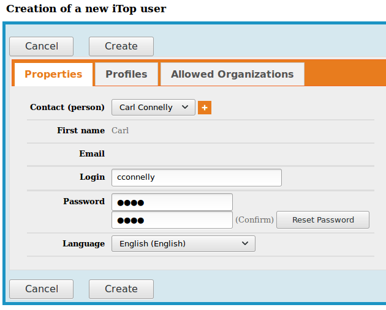
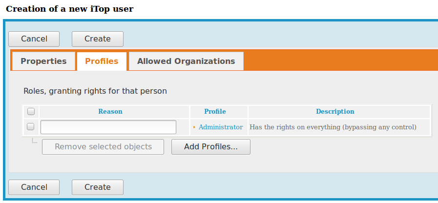
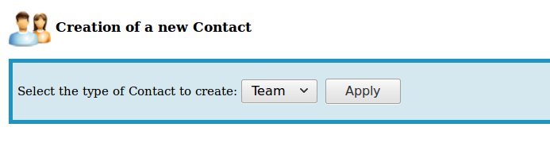
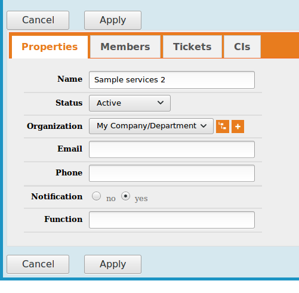
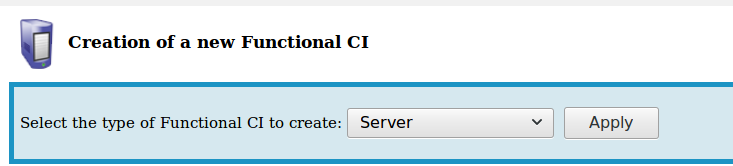
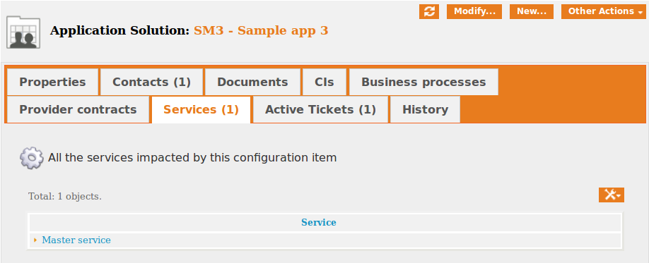
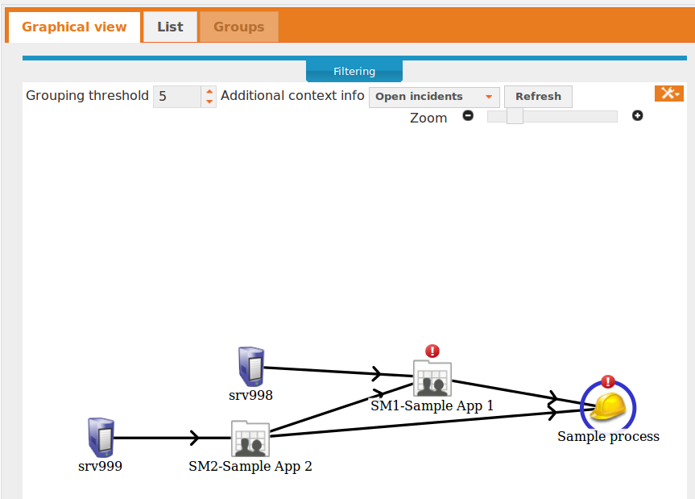

== Lab 09: IT Service Management Suite (Process Management)

This lab will introduce you to a full IT service management suite supporting the ITIL process framework.

Learning objectives:

* Understand how ITSM software is used to support collaborative ITSM processes
* Document a simulated IT service for your team and execute various ITSM processes against it
* Evaluate ITSM software in light of industry reference architectures

=== What is iTOP?

iTop is enterprise software that helps organizations manage the business of IT. Organizations need to respond to service requests, track incidents, review change orders, and manage assets. iTop is a centralized web platform that ties all of these processes together. It consists of many screens that help you add, update, and delete across a complex, shared data model. It is intended as a tool to structure collaboration, in the form of defined processes.

image::itop.png[]

=== Getting started

First, ssh with X-windows to seis664.gps.stthomas.edu.

If you are going to use X-windows, you should log in with the following options if you are on a Mac:

    ssh -X yourID@seis660.gps.stthomas.edu

If you are on a PC using Putty or MobaXterm, you will have a checkbox (that may have defaulted to checked) to enable X. You're on your own to figure out compression options.

Once logged in, bring up Firefox over X:

    firefox -YC -no-remote &

then, using that Firefox window, log in to:

http://localhost:8037/web

Default user name is "admin," no password. (Don't do this in the real world.)

At the same time, using a LOCAL browser (not the Firefox where you have iTOP), go to the iTop documentation at:

https://wiki.openitop.org/doku.php?id=start

Finally, you will need to open the https://github.com/dm-academy/aitm-labs/blob/master/Lab-09/Copy%20of%20sample-data.xlsx[sample data] Excel file.

=== Scenario

Here is the scenario: you are six teams within a larger organization. Additionally, each individual owns an application. The overview of your tasks is:

* Create your team and members
* Enter your systems:
** Business processes
** Applications
** Servers
* Register an Incident against a Server
** Identify impacted processes, business objectives, and other teams in the Incident
* File an Emergency Change to restore service, in coordination with all stakeholders
* Create a Problem ticket representing root cause
* File a Change to fix the Problem

**Instructions**

.Critical note
****
There are dozens of possible screens in iTop, and the lab does not document them all with screenshots. It would start to become very redundant.

You will find that the behavior of iTop is very consistent. You can create, search, modify, and delete objects and their relationships. Feel free to explore and experiment. This is a lab simulation and you cannot damage anything. It will be deleted and recreated at the end of the course.

You can create relationships to things that are not your own. Just don't delete or modify anything someone else has created.

****

== Configure the system

We are leaving the following undefined:

* Locations
* Roles
* Organizations

== To create teams and individuals

Each individual person should create their own Person and User account.

In iTop, "Contacts" include "Persons" and "Teams." *Contacts are not necessarily iTOP users, nor are iTOP users necessarily Contacts.*

The "New Contact" command under Configuration Management|Contacts is used to create teams and individuals in iTOP.

** Create Persons, one for each team member, with your real name and associate them with the Team.

image::contacts.png[]
image::person.png[]

* In Admin tools|User Accounts, create an iTOP account for the Person you just created- use your St. Thomas email ID and "test" as password. (Don't do this in the real world.) Make them an administrator to start.
** assign each User Account to the appropriate Person

** for now, each user can have the Administrator profile

* In Configuration Management, set up your Teams according to the Team column.

Review your progress with the instructor before continuing.

== Creating CIs

* Create the servers your applications run on
** Configuration Management|New CI|Server

* Create your applications in the same way
* Create your business processes
* Create your inter-application dependencies (you will need to coordinate with other teams, who may not have completed their CMDB work when you need it.)
** Your business process depends on the applications
** Your applications depend on the servers
** Your applications depend on each other
** Your applications, under the Contacts tab, are assigned to your team (not persons)

In order to link Configuration Items (CIs), you need to Modify them. The interface is simple.

For each CI, you should associate it to the "Master service." If you do not do this, you will not be able to assign people to the associated Changes:

Link them together as appropriate. Refer to the "Sample process" configuration. When you are done, go to your Business Process CI and run a Depends On report (top right "Other Actions"). It should look something like this:

Create a Slack channel for your team, called #lab-09-tXX where XX is your team name.

When you have your topology defined, post a screenshot to Slack. Do not continue until all teams have completed their configurations. (Take a break if you need to, or start your reading for next week.)

Log out as admin and back in as yourself (your St. Thomas email ID).

== ITIL process

Each team will have two incidents, one reported by them, one reported by someone else. They may also be called in regarding other issues and dependencies.

Both incidents will follow a common process:

. Register the Incident
. Create an Emergency Change to fix it (referencing the Incident)
. Approve, schedule, and complete the Change
. Close Change and then the Incident
. Open a Problem referencing the Incident
. Create a Normal Change to resolve it (referencing the Problem)
. Approve, schedule, and complete Change
. Close the Change and then the Problem

At the same time, coordinate with all other teams who are indicating dependencies and requiring you to resolve issues that they are seeing.

.IMPORTANT
Read through the two workflows below, then go to your team section for what you need to do specifically in the tool.

=== Create an Incident and resolve it with an Emergency Change

The following exercises reflect the traditional ITIL workflow. Here are the rules:

An Incident against a CI follows the general process:

* Some approach for restoring service needs to be agreed upon as an emergency Change (e.g. "reboot server XXX" or "restart app server on XXX")
** This should be done in Slack, in the owning team's channel, with all impacted teams involved. When agreement is reached, create the Emergency Change record with related CIs *AND* related Incident. Assign it to the Team owning the business process, and to the individual owning the app. See the C-000002 Change.
** The individual owning the change needs to modify and save it multiple times, in order to move it through the lifecycle.
**  You may have a server down and another team calls you about it. You should only create one Incident.
* Assume that this is not the first time this has happened. You need it to stop.

=== Create a Problem and resolve it with a Normal Change

* Create a Problem record. Relate it to the Incident. Discuss on Slack with all stakeholders - which are you going to do to fix the problem going forward?
* Create a Normal Change describing this. Relate it to the Incident. Approve the Change.
* Perform the action and update the Change accordingly.
* Close the Change with documentation as to the results of your activity.

IMPORTANT: I am not clear exactly whether a person can be "added" as an approver on a Change, I did not have time to figure this out. Extra credit for the team who figures this out.

=== TEAM SPECIFIC TASKS

==== T01-Marketing services
. You have an incident on srv001, the J2EE process is hung
. You notice that the CSM app is down

==== T02-eCommerce services
. You have an incident on srv007, the Oracle database has gotten corrupted
. You notice that the PM app is slow

==== T03-Fulfillment services
. You have an incident on srv016, the message queue appears to be stuck
. You notice that the CRM app is down

==== T04-Supply chain services
. You have an incident on srv020, it has crashed hard
. You notice that the OM app is down

==== T05-Corporate services
. You have an incident on srv024, the software is not functioning due to a recent change
. You notice AP is down

==== T06-Product services
. You have an incident on srv031,
. You notice the TT app is down

== Free form activities

Perform the following actions, as many as you have time for:

* Initiate and fulfill a service request for access against one of your applications, or another team's.
* Add new, or new kinds, of resources/CIs to your application. (These can be imaginary.) Post the dependency graph to Slack.
* Add dependencies on other teams' resources, and see that you are added as a Change approver.
* Be creative!

== ITSM tool and the architecture of IT

Discuss:

image::MasterSystemsArch.png[]

(Betz)

image::IT4ITL2.png[]
(IT4IT)

* What parts of these reference architectures are fulfilled by this tool?

* What do you think of this tool in light of current industry trends to virtualization, infrastructure as code, and faster cycle times?
