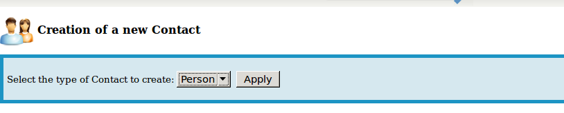
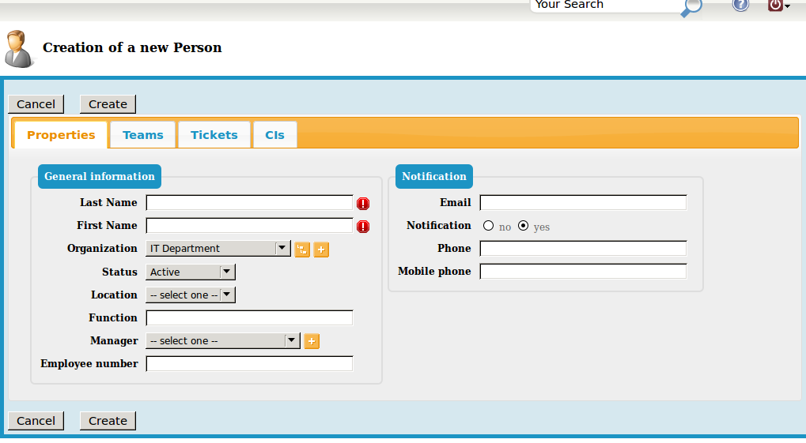
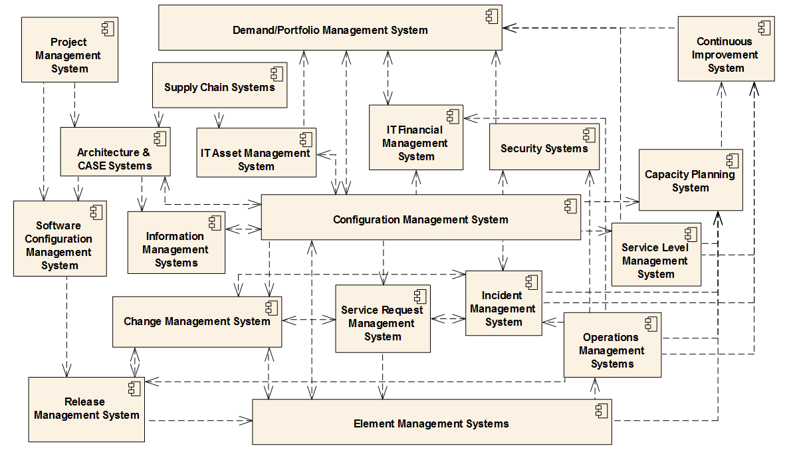
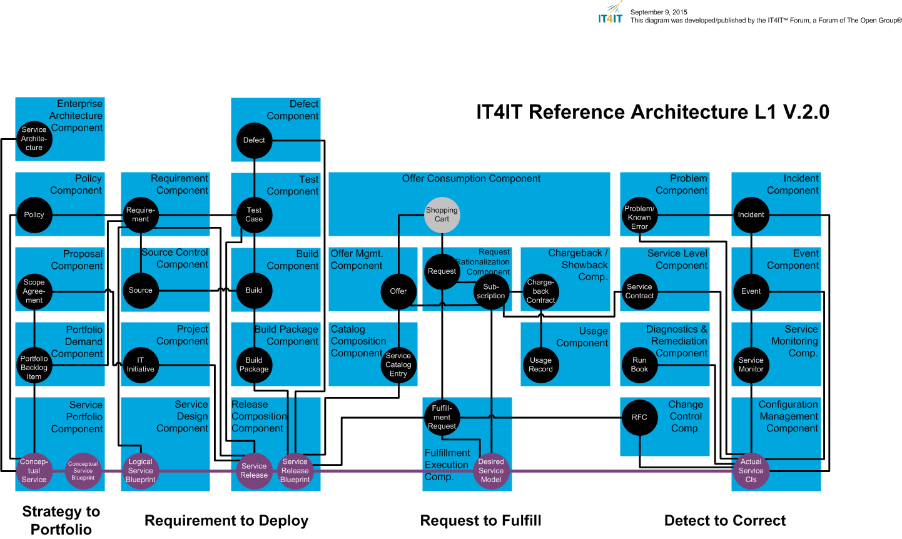

== Lab 09: IT Service Management Suite (Process Management)

This lab will introduce you to a full IT service management suite supporting the ITIL process framework.

Learning objectives:

* Understand how ITSM software is used to support collaborative ITSM processes
* Document a simulated IT service for your team and execute various ITSM processes against it
* Evaluate ITSM software in light of industry reference architectures

=== What is iTOP?

iTop is enterprise software that helps organizations manage the business of IT. Organizations need to respond to service requests, track incidents, review change orders, and manage assets. iTop is a centralized web platform that ties all of these processes together. It consists of many screens that help you add, update, and delete across a complex, shared data model. It is intended as a tool to structure collaboration, in the form of defined processes.

image::itop.png[]

=== Getting started

First, ssh with X-windows to seis664.gps.stthomas.edu.

If you are going to use X-windows, you should log in with the following options if you are on a Mac:

    ssh -X yourID@seis660.gps.stthomas.edu

If you are on a PC using Putty or MobaXterm, you will have a checkbox (that may have defaulted to checked) to enable X. You're on your own to figure out compression options.

Once logged in, bring up Firefox over X:

    firefox -YC -no-remote &

then, using that Firefox window, log in to:

http://localhost:8037/web

Default user name is "admin," no password. (Don't do this in the real world.)

At the same time, using a LOCAL browser (not the Firefox where you have iTOP), go to the iTop documentation at:

https://wiki.openitop.org/doku.php?id=start

=== Scenario

Here is the scenario: you are six teams within a larger organization.

You will be documenting your existing pipelines.

**Instructions**

* Set up your teams (we won't use the existing teams in iTOP - however, the existing data may help you understand how to set things up)
* Name them TeamX where X={1-4}
** as admin, give each person on your team an ID and password (Configuration Management|Contacts) - use your St. Thomas email ID and no password. (Don't do this in the real world.)
** assign each to the appropriate team

.Critical note
****
There are dozens of possible screens in iTop, and the lab does not document them all with screenshots. It would start to become very redundant.

You will find that the behavior of iTop is very consistent. You can create, search, modify, and delete objects and their relationships. Feel free to explore and experiment. This is a lab simulation and you cannot damage anything. It will be deleted and recreated at the end of the course.

You can create relationships to things that are not your own. Just don't delete or modify anything someone else has created.

Please, prefix anything you create with "XX" where X is your team name. For example, Team Four might create a server "04-email-srv" representing their email server.

Refer to the iTop instructions, course readings (especially Betz), and online ITSM/ITIL materials as necessary.

****
* Set up your configuration items
** Servers
*** manosXX
*** cerebroXX
*** etc
** Applications (with your team #)
*** gitXX
*** jenkinsXX
*** artifactoryXX
*** webXX (your app)

Link your applications to your servers.

* Jenkins runs on hombros and brazos
* Central git on cerebro
* artifactory on espina
* webXX on cara and manos

== A typical ITIL scenario
The following exercise reflects an end to end ITIL workflow. Refer to previous labs as necessary.

Note, the following assumes your team's pipeline is still active.

In your same Firefox instance, additionally open your Nagios console:

http://nerviosxx/nagios[http://nerviosxx/nagios]

*First*, as in https://github.com/dm-academy/aitm-labs/blob/master/Lab-06/06-tech-lab.adoc[Lab 6], do

 vagrant suspend caraXX

For the sake of the exercise, consider this as a "mistake" on the part of some staff person who did not realize that caraXX was running the production web site.

*Second*, go into iTop and register this as an Incident. Be sure to link the incident to at least one CI. You have three choices:

* Link the incident to caraXX
* Link the incident to the application webXX
* Link it to both

Discuss as a team - which are you going to do? Why? What would IT Service Management philosophy suggest?

*Third,* Decide what you need to do, to restore service.

*Fourth*, create a Change describing this. Relate it to the Incident. Approve the Change.

*Fifth,* perform the action and update the Change accordingly.

*Sixth,* close the Change with documentation as to the results of your activity.

*Seventh* Assume that this is not the first time this has happened. You need it to stop.

* Create a Problem record. Relate it to the Incident.
* What is your plan to prevent critical servers from being suspended?

== Free form activities

Perform the following actions, as many as you have time for:

* Initiate and fulfill a service request for access against one of your services, or another team's.
* Add new, or new kinds, of resources/CIs to your application. (These can be imaginary.)
* Add dependencies on other teams' resources, and see that you are added as a Change approver.
* Be creative!

== ITSM tool and the architecture of IT

Discuss:

(Betz)

(IT4IT)

* What parts of these reference architectures are fulfilled by this tool?

* What do you think of this tool in light of current industry trends to virtualization and faster cycle times?
