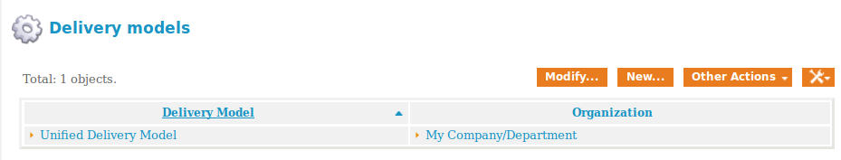

= Installing iTOP

11/6/2015

from http://sourceforge.net/projects/itop/files/itop/2.2.0/

"The documentation about iTop is available as a Wiki: https://wiki.openitop.org"

http://downloads.sourceforge.net/project/itop/itop/2.2.0/iTop-2.2.0-2459.zip?r=http%3A%2F%2Fsourceforge.net%2Fprojects%2Fitop%2Ffiles%2F&ts=1446939722&use_mirror=tcpdiag

script pies.sh

no password on mysql

Xwindows to http://localhost:8037/web/setup/index.php

"root" is the default DB login, no PW
"itop" db (new)

production instance (not demo)
service management for enterprises
ITIL compliant
ITIL changes, KEs, problems

see web https://wiki.openitop.org/doku.php?id=2_2_0:admin:install_wizard

== Notes

=== 2015.11.13 notes:

Bad crash, not sure why. Too many VMs & Firefox sessions, perhaps. Shut down all pipelines & rebooted server. Next time: install iTOP with more capacity (Vagrant config). Would be nice to have some VMs & monitoring going. Ideal: Nagios/iTOP integration.

Comment from class: Describe a more typical ITIL flow - incident, problem, change...

=== 2016 spring notes:
installed as enterprise, not service provider, production not test (recalling that the test data caused confusion)
updated pies.sh obvious error but did not re-run it.

People got done too early.

Add lab exit/grade criteria - screen shots, etc..

Delivery model problem - prevents team assignment to incident -

Add help desk exercise.

=== 2017 fall
script worked well, updated so that wget wasn't running in background

iTOP is always a pain with its service model. The essential component is creating a master delivery model and assigning it to the company:

Too much config, and we didn't get to the incidents soon enough. Need to suspend and save that instance for post-mortem. Lots of valuable data. Usual problem of not being able to assign incidents/changes to the right team - what is it? Service model stuff? Got to figure out. 
