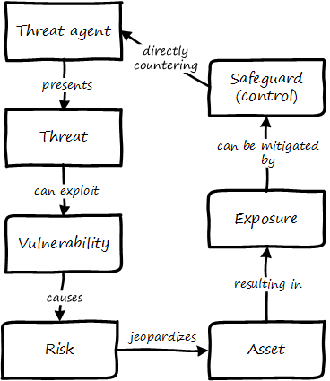

= Lab 10: Security, and Governance, Risk, and Compliance

== Objectives

In this lab, you will gain some hands on experience in vulnerability scanning and remediation.

Objectives:

* Understand a "vulnerability" and how it can be detected
* Understand how a vulnerability may be fixed or remediated

== Overview

Working individually, you will run an "inside-out" vulnerability scan and a simple "outside-in" scan on the servers.  The testing will be performed by downloading two vulnerability scanners and running them on your servers.

You will research the results and recommend at least one fix that can be implemented in the Vagrantfile and associated cookbook and/or shell script for building the server.

You will write (with instructor assistance) a fix as a shell script to be pulled into the Calavera repository.

=== Getting started

Go to your home directory.

 cd

You should still have a vagrant directory. Go:

 cd vagrant
 vagrant up

If this doesn't work, go back to https://github.com/dm-academy/aitm-labs/blob/master/Lab-02/02-tech-lab.adoc[Lab 2] and follow the Section 1 instructions just up through getting the simple Vagrant machine running (do not continue to section 2 in that lab.)

Now, install Lynis. The overall instructions are here:

https://cisofy.com/documentation/lynis/get-started

You should download using the git approach.

NOTE: If you choose to clone into /usr/local, you will need to sudo. 

This scan is run internally on the server, as a script or application that reviews the server's configuration in painstaking detail. It will generate hundreds of findings. You should pick one or two and research them and figure out if there is an easy fix.

Start by logging into your personal server. You should be in `/home/vagrant`. Go to:

https://cisofy.com/documentation/lynis/get-started/#first-run

You should be able to run the first scan as the lynis directions suggest. Lots of output that looks like:

....
- Checking for old files in /tmp                            [ OK ]
 - Checking /tmp sticky bit                                  [ OK ]
 - Mount options of /                                        [ OK ]
 - Checking Locate database                                  [ FOUND ]
.
.
.

 * Consider hardening SSH configuration [SSH-7408]
    - Details  : AllowAgentForwarding (YES --> NO)
      https://cisofy.com/controls/SSH-7408/

  * Add a legal banner to /etc/issue, to warn unauthorized users [BANN-7126]
      https://cisofy.com/controls/BANN-7126/

....

Let's fix the legal banner issue. See:

* http://askubuntu.com/questions/420375/how-to-add-legal-banner-in-etc-issue-and-etc-issue-net-in-ubuntu
* http://csrc.nist.gov/publications/nistbul/csl93-03.txt

Between these two resources you should be able to fix the issue. If you have questions, post them to Slack.

When you have fixed the issue, run the scan again and post evidence to Slack.

=== System hardening

Now for the hard part. Find another vulnerability you can fix. To use class time most efficiently, you should post the vulnerabilities you are researching to Slack. Don't start on something someone else is doing.

You should take some time and think about and/or research the risk any given vulnerability presents. Remember the CISSP terminology:

We will pause class and discuss interesting cases.

Be prepared to share you results, positive or negative. If you fix a vulnerability, be sure to document the steps so they could be scripted.

After you have fixed one more lynis vulnerability, read http://www.sonatype.org/nexus/2015/11/13/did-you-wake-up-to-an-alert-about-the-java-deserialization-vulnerability and discuss with your neighbors. What is the National Vulnerability Database? Be prepared to discuss in class.

=== Web vulnerability testing scan
(if time)

When you have reflected enough on the Java deserialization vulnerability and the implications of that article, move on to a Web vulnerability.

First review the first few pages of the https://github.com/zaproxy/zaproxy/releases/download/2.4.0/ZAPGettingStartedGuide-2.4.pdf[zaproxy docs].

Exit from your VM to the main server. You should be in your publicxx directory (go `cd` if you are not).

Create a directory called "lab-10" there, if your teammates have not already.

(Seems like you just did this, what's up with that?)

Go:

....
wget https://github.com/zaproxy/zaproxy/releases/download/2.5.0/ZAP_2.5.0_Linux.tar.gz
tar -xvf ZAP_2.5.0_Linux.tar.gz

cd ZAP_2.5.0/
./zap.sh -cmd -quickurl http://10.xx.0.15:8080/MainServlet
....

We run this script externally to the machine being tested, and give it the URL. It then probes the URL and the server, as a form of penetration testing. It will again generate a number of findings. Research them and figure out if there is an easy fix. Share with class on Slack.

NOTE: You will get raw XML dumped to the terminal. You can cut and paste this to an HTML document on your workstation and open it with a browser for an easier view.

Now, try

`./zap.sh -cmd -quickurl http://10.xx.0.12:8081/artifactory`

More errors than before... why? Discuss. How would you fix these?

== Permanently fixing one or more vulnerabilities

First, you need to figure out the configuration change required to fix the vulnerability. It should be something that you can script.

For this reason, you should choose a vulnerability that is relatively simple to fix.

* something installed that doesn't need to be
* something that should be there, that isn't
* permissions that need to be tightened down.

In order to fix the vulnerability (fixing something on caraXX would probably be simplest):

. Run the necessary commands to fix the vulnerability.
. Put them into a shell script.

So, you have a script called servername.sh. Perhaps you've run it on the current server and fixed things, but that doesn't help if we refresh the server.  We need to suggest the script as a change to the core recipe.

To do this, you need to create a team fork in the main Calavera repository. Clone down to a working directory you have write access to on the main server (either your home dir or an `su`'d publicxx dir), vagrant up the virtual server in question, and work the fix. When you are satisfied, submit a pull request.

=== Optional ITSM process
Time and instructor lab preparation permitting:

* The vulnerability should be registered as a Problem in iTOP, against the server it is detected on.

* The server rebuild that fixes it will be executed as a Change.

* The Change and the Problem should reference the git pull request ID.

* The Change will then be confirmed as having fixed the Problem, which will then be closed out.

== Tools
The following tools were evaluated as part of developing this lab.

=== Lynis

https://cisofy.com/lynis/
http://linux-audit.com/how-to-deal-with-lynis-suggestions/
http://linux-audit.com/linux-vulnerabilities-explained-from-detection-to-treatment/

=== OpenSCAP
http://www.open-scap.org/

=== ZAP
https://github.com/zaproxy/zaproxy
https://github.com/zaproxy/zaproxy/releases/download/2.4.0/ZAPGettingStartedGuide-2.4.pdf

=== NIST database
https://nvd.nist.gov/

=== Listings
http://resources.infosecinstitute.com/14-popular-web-application-vulnerability-scanners/

http://www.networkworld.com/article/2176429/security/security-6-free-network-vulnerability-scanners.html

=== Useful stuff
http://hardenubuntu.com/initial-setup/
http://www.sonatype.org/nexus/2015/11/13/did-you-wake-up-to-an-alert-about-the-java-deserialization-vulnerability

http://continuousdelivery.com/2013/08/risk-management-theatre/

== Fixes
https://help.ubuntu.com/lts/serverguide/NTP.html

== Lynis
Extra credit. Lynis is another option, but it doesn't find as much as OpenSCAP.

The overall instructions are here:

https://cisofy.com/documentation/lynis/get-started

This scan is run internally on the server, as a script or application that reviews the server's configuration in painstaking detail. It will generate hundreds of findings. You should pick one or two and research them and figure out if there is an easy fix.

Start by logging into your assigned server. You should be in `/home/vagrant`. Go

....
vagrant@manos1:~$ mkdir lab-10
vagrant@manos1:~$ cd lab-10/
vagrant@manos1:~/lab-10$ git clone https://github.com/CISOfy/lynis
vagrant@manos1:~/lab-10$ cd lynis
....

We use the git option so that we have the latest version.

You can now go to:

https://cisofy.com/documentation/lynis/get-started/#first-run

You need to call lynis using the `./lynis` approach, since its path is not in your $PATH variable. Try following the instructions, which have interesting inconsistencies with what will happen.

In particular you will see:

`WARNING: output may be incomplete or inaccurate, you should run this program as super-user.`

Hit Ctrl-C to abort. What do you need to do? Do it. [See hint #1 below if you are completely stumped, but you should know this by now. It's likely to be on a test.]

Now you are getting a different error, not reflected in the instructions either. The error gives you all that you need to fix it. [See hint #2 below.]

Fixed? Now you should be able to run the first scan as the lynis directions suggest.

=== Hints

Hint #1: Run it as `sudo`

Hint #2: `sudo chown -R root:root ../lynis` - you NEED to understand this -
`
