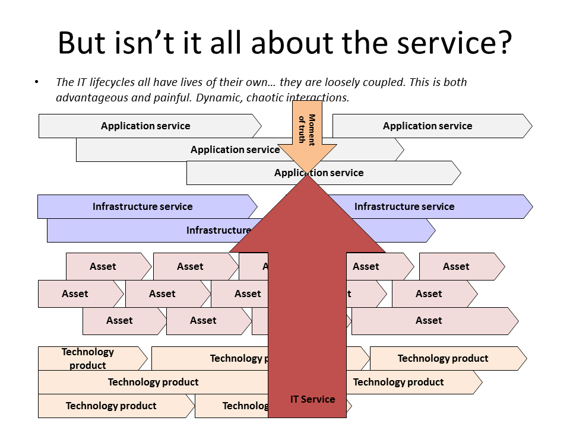

== Lab 12: Enterprise Architecture & IT Portfolio Management

Version 2, 12/11/2015

In this final lab, you will analyze an IT portfolio and come up with a set of recommendations for presentation to the class.

You have seen this diagram:

These interrelated concepts are represented in the course Excel spreadsheet. There is a significant amount of data.

This is an exercise in critical thinking and while it is not completely a matter of opinion, there are subjective aspects. You need to be prepared to justify your conclusions.

You have a limited budget. You cannot fund all the requests.

At a high level, you need to answer:

* What are the best investments?

* What are the worst investments?

* What technology product would you replace first?

* What is an example of a service that should be

** positioned for expanded use?
** upgraded?
** retired or outsourced?
** re-evaluated with closer business partnership?

(The above questions are overview; a more detailed set of instructions and objectives is presented below.)

Important disclaimer: The business opportunity each system supports is critically important in the real world. However, systematically exploring this would require business architecture and strategic planning techniques not covered in this class.

Therefore, you are approaching this portfolio from the perspective of an infrastructure manager. You understand what systems support revenue generating activities, but you do not have much insight into new business initiatives.

Assume that new strategic initiatives ("change the business") are funded from a different budget, and this overall portfolio is more of a "run and grow the business" set of activities.

== How to evaluate fitness?

The following matrix and discussion will help you think about the problem:

|===
||*Low business fit* |*High business fit*
|*High technical fit* |Re-evaluate with business partners; experiment |Encourage expanded use. Ask: would more investment drive more results?
|*Low technical fit* |Outsource or retire |Invest
|===

Indicators of business fitness:

* High/increasing customer/user satisfaction score
** _Higher is better. This is a critical metric. It is about 80% of business fit for this exercise._
* Revenue dependency
** _If there is a revenue dependency, the system cannot be outsourced (corporate policy)_
** _No revenue dependency does not automatically mean the system should be outsourced. HR systems have no revenue dependency, but represent critical and risky functionality._
** _The most important systems combine revenue dependency with large asset bases, high risk, and/or many other systems' dependencies_
** _For infrastructure systems, consider whether the systems using them have revenue dependencies._

Indicators of technical fitness:

* High SLA adherence (incidents)
** _Low would indicate low fitness_
* Current assets & technology platforms
** _Older indicates low fitness. An earlier sunset date means the product is more outdated; again, lower fitness._
* NPS from support teams & architects
** _High is good_
* High/increasing customer/user satisfaction score
** _Low score *might* reflect poor technical platform_

Also, be aware of the dependency columns. An application service also is subject to the risks and issues of anything it is dependent on.

IMPORTANT: Remember that "services" and "technology products," for the purposes of this lab, are two distinct concepts.

== The portfolio spreadsheet

The assignment is based on the spreadsheet titled "portfolioLab.xls." This spreadsheet has 3 tabs:

*dictionary* - definitions of the fields, including how they are generated.

*dataset-gen* - a set of formulas that automatically generates various portfolio scenarios. Try hitting the F9 key and watch what happens.

*sample* - a snapshot I took of a data set for discussion purposes.

== Review of sample data set
The dataset is intended to cause questions. The amounts requested may not be justified. There may be ambiguities in the data. Considering the sample data set, here are some lines of inquiry. Read the following carefully and cross reference to the data set:

The infrastructure systems are by far the most expensive. This is because they support the application systems. However, the amounts they are requesting may not be reasonable. For example, the "zulu" infrastructure system is requesting $32 million dollars. Yet, we see that only 3 systems use it. Of these only one generates revenue, and that system is small. Perhaps this system should be consolidated with another system. It would be in the bottom left quadrant.

The "romeo" system is also questionable. Have a look at it and discuss. What depends on it?

On the other hand, the "pi" system has an aging asset base, technology products close to retirement (that is, an _earlier_ retirement year), and is a well regarded revenue producing system with considerable heft and significant dependencies in column P. Its request should be fully supported. It would be in the bottom right quadrant. This is the money quadrant; systems that land here in general should get some love. Notice that there is an inconsistency between the technical team's opinion and the objective reality of the asset and technology base. This might need further investigation.

The "zeta" system is well regarded technically, but has room for improvement in terms of business fit. It would be top left in the quadrant. Some re-evaluation of its mission might be appropriate. It is not clear why they would want significant enhancement dollars as both the asset base and the technology dependencies are current. Note that the SLAs adherence is poor; this might be why.

Finally, the "delta" system appears solid both in terms of business and technically. This may seem to be "good" but why do they need investment if everything is going well? Are there opportunities to expand the system in new business directions?

Out of this brief analysis, we clearly would prioritize pi and deprioritize zulu. The other two require further investigation and would land in the middle of the pack.

In terms of product, if you sort the spreadsheet by first column N and then column J, you will see that Product2 and Product8 support significant systems (add up the heft scores for the systems they support.) It might be good to prioritize sunsetting those products. Think about what this means in terms of your recommendations. Often, services that add little value are sunset when their supporting products become obsolete.

IMPORTANT: Product is NOT the same as service. Services DEPEND ON products, e.g. your e-commerce Web site depending on the Oracle database. A _product_ might be approaching or past its sunset date, but the _service_ needs to be kept running - you make money off it! A product running past its sunset date is very risky, due to lack of support. Most services depend on multiple products, but we simplify to one for this exercise.

== The exercise

=== Setting up

1. Download the spreadsheet from https://github.com/dm-academy/aitm-labs/blob/master/Lab-12/portfolioLab.xls. Click "View Raw" to download.
2. Create a new tab and name it for your team. Save your spreadsheet somewhere you can find it.
3. Go to the dataset-gen tab and hit F9.
4. Select all and paste AS FORMATTED VALUES to your new tab.
5. Save again.
6. You will want to enable filtering on the Data tab.

=== The analysis

On a Powerpoint deck, based on the matrix above, the spreadsheet definitions, and your analysis, answer the following:

1. What are the top 3 application (not infrastructure) candidates for investment? Give your reasoning.
1. What are the top 3 application candidates for retirement or outsourcing? Give your reasoning.
1. What infrastructure system is the top candidate for investment? Consider what depends on it. Give your reasoning.
1. What is the most risky technology product? What has the most dependencies, or the most significant dependencies? (When a product has multiple dependencies, sometimes it is effective to fund a project to upgrade it across the board.)
1. Finally, give one example each of a service that should be

** positioned for expanded use?
** re-evaluated with closer business partnership?

Again, give your reasoning.

10 pts extra credit: prepare a bubble chart for some subset of the data. Your bubble chart must have the dimensions clearly labeled, including what the meaning of size and color are. Recommend:

* Y-axis - business criticality
* X-axis - technology soundness
* Size: request
* Color: application vs infrastructure

You may need to define some of your own calculations (e.g. adding some factors) to achieve these recommendations. I reserve the right to give partial credit, or send back to you for rework.

Time permitting, we will review some of these presentations in class.

=== Notes on performing the analysis

* It is critical to read and master the definitions listed in the spreadsheet. Pay careful attention to the implications of Average Asset Age, Primary Technology Product Dependency and Technology Product Sunset Year.
** In particular, an impending Product Sunset means that you need to invest in the next version, or else retire the service.
