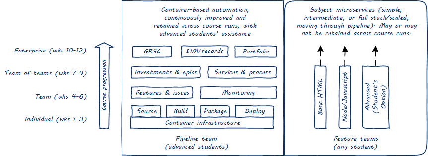

== Overall Lab Concept (Renewed Feb 2018)

_Overall philosophy: this course is an exercise in ongoing experimentation. It is a safe space for you, the students to familiarize yourselves with cutting edge technologies and practices. Because it is intended to be industry relevant and current, these flipped course lab sessions may include technology unfamiliar to me (your instructor). The most important objectives are collaboration and learning. The specific technical platforms in any given semester are secondary. We will struggle, we will try, fail, and try again, we will pivot, and we will succeed._

* The end state is a diverse collection of digital services, owned by individuals and teams, moving through a common pipeline from development to production
* The pipeline team wlll consist of the most experienced students. It owns and coaches people on source control, build management, package management, monitoring, and the core container platform.
**  As of February 2018, the current technical choices are git, Jenkins, Artifactory, Kubernetes, and Nagios (or other monitoring tool TBD). There will be two sub-teams, one to own git, Jenkins and Artifactory, the other to own    Kubernetes and Nagios (or other tool).
* Code is both built and deployed with Jenkins.
** How Jenkins relates to Kubernetes has not yet been piloted in this class.
** Artifactory may store Docker images (still under investigation).
* If you are a feature team or individual:
** You will own something that executes and displays some sort of behavior. It can be as simple as a static web page, or as complex as a complete ecommerce or machine learning system, within the bounds of our server’s capacity.
** Development may be performed directly with Docker on the development side, or also with Vagrant. We’ll be assessing the suitability of each.
** The production system MUST be packaged as a container deployed on Kubernetes. We will not be running Node.js, Apache, Postgresql, etc natively on the production server. We will only be running them in containers.
* You may download functionality freely from the Internet. You do not need to understand all aspects of what you download. BUT - you must understand it well enough to be able to change it. I will provide new user stories appropriate to your system, so you need to be able to modify it.
** A simple application example would be the “Hello World” Node.js app in “Hello Minikube” https://kubernetes.io/docs/tutorials/stateless-application/hello-minikube/.
** Another option would be a simple Node.js server that serves static html pages. https://blog.risingstack.com/your-first-node-js-http-server/
* There are many more advanced applications available.
* You must figure out some form of automated test for the application. It does not need to be a code-level test (such as jUnit). It may also be an external test, such as a script that verifies that an HTTP server is running and delivering a certain URL.
* Your system must be able to be entirely represented as code (e.g. Dockerfiles, Javascript, HTML, etc), or static images (meaning .png or .jpg files). Of course, your code may reference online repositories. You may use the following well known, canonical repositories:
** Docker registry,
** Debian apt
** Node package manager
** Github
** If you want to use anything else, I must approve it.
* You are expected to challenge yourself. If you are choosing a system below your experience and capabilities, and therefore completing assignments with undue speed, I may reassign you to the platform team or expect you also to help with supporting your classmates.
* Your work must be tracked in Trello. Before you engage in a task, you must enter it into your todo list. Both teams and individuals may have Trello boards.
* In the second half of the course, we will experiment with coordination, portfolio thinking, and bringing people together into larger working constructs. We will also look at the portfolio from the perspective of governance, security, information management, and architecture.
** This will include deeper scrutiny of choices you have made in your downloads and dependencies.
* The platform team will be in a service relationship to the rest of you. You should communicate with them on Slack.
* You can choose to work on your own or organize in teams. I expect everyone on a team to participate equally. I leave the option of working alone for those who might find themselves sitting back too far in a team context, especially students with less experience.
* I am not going to be overly prescriptive about your day to day work. We have a high level objective as a class: build a functioning end to end pipeline that supports a diverse variety of feature-oriented systems. Beyond that, you will self-organize to a large degree, within certain guardrails of platform technology and collaboration mechanisms.
* I will be meeting with individuals and teams 1:1 in rotation during every class. 

Rough lab outline, which still will track the book:

Labs 0-3 remain very prescriptive to ensure everyone has basic systems and infrastructure as code understanding, including Ubuntu, git, Vagrant, and Docker.

Labs 4-6 *should* see the initial creation of your deployment project, in both development and production instances. This includes the ability to change your system on an ongoing basis.

We will spend some time thinking about your system as a "product." The pipeline team will start to take work requests for assistance with job creation and monitoring. This flow of work will also provide material for understanding work in progress and visualization.

Labs 7-9 are the least certain at this point. It is likely that they will be fully consumed by automating and monitoring your systems. If possible, it would be ideal to bring in some kind of ticketing or workflow for coordination. This will require you to integrate your systems in some sense, if only for a unified release. This might take the form of simply defining a release dependency, such as "the two of you must release your new feature together."

Labs 10-12 are the "governance" labs where we start to examine the implications of what we have built, developing inventories, assessing risk, and making some kind of plan for the future.
